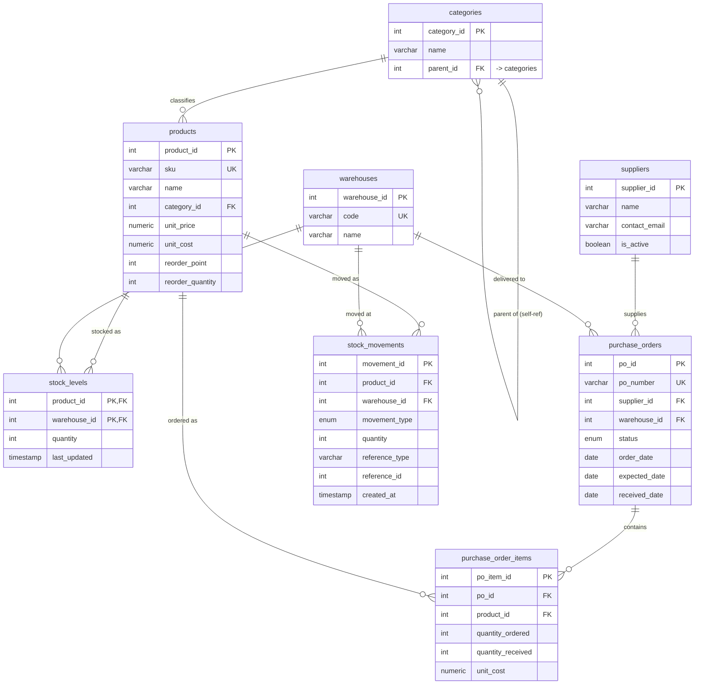

# Centralized Inventory Management System — Entity-Relationship Diagram

## How to generate the *live* diagram in DataGrip

DataGrip can draw this from your actual database — always in sync with reality:

1. In the **Database Explorer**, right-click **`inventory_mgmt → public`** (the schema)
2. Choose **Diagrams → Show Visualization** (or press **⌥⇧⌘U**)
3. A diagram tab opens with all 8 tables as boxes and the foreign keys as connecting lines
4. Tips while viewing:
   - Drag boxes to rearrange; the layout is yours to organize
   - Hover a line to highlight the exact column → column link
   - Right-click the canvas → **Show → Columns / Keys / Indices** to control detail
   - Right-click → **Export to File** to save a PNG for notes

## The same model, as a Mermaid diagram

This renders in any Markdown viewer that supports Mermaid (GitHub, VS Code with a
Mermaid plugin, many note apps). It's a portable, version-controllable picture of
the schema.

## How to read it

- **`||--o{`** means "one-to-many": one category classifies **many** products; one
  product can be a line on **many** purchase orders, etc. The `||` (exactly one)
  side is the *parent*; the `o{` (zero-or-many) side is the *child* holding the
  foreign key.
- **PK** = primary key (uniquely identifies a row). **FK** = foreign key (points at
  a PK elsewhere). **UK** = unique key (no duplicates, e.g. `sku`, warehouse `code`).
- **`stock_levels`** has a *composite* PK `(product_id, warehouse_id)` — that's the
  database guaranteeing **one stock row per product per warehouse**. It's the classic
  "junction table" resolving the many-to-many between products and warehouses.
- **`categories` points at itself** (`parent_id → category_id`) — that's how a tree
  (Electronics → Laptops) lives in a single flat table.
- **`stock_movements.reference_id` has no FK line** on purpose — it's *polymorphic*:
  it may point at a purchase order, a sales order, or nothing, depending on
  `reference_type`. That flexibility is the trade-off for losing a hard FK guarantee.

## The shape of the model, in one sentence

`products` and `warehouses` are the two "anchor" entities; `stock_levels` is the
**current balance** where they meet, and `stock_movements` is the **history** of how
that balance got there — with `suppliers` + `purchase_orders` feeding stock *in*.
