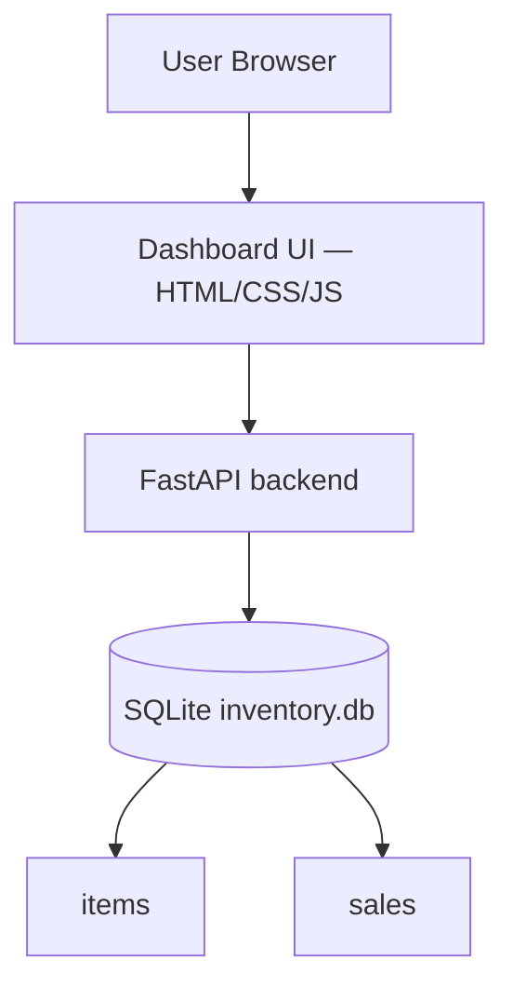

# Sales & Inventory Insights Dashboard

A small read-only inventory dashboard: a FastAPI service over SQLite exposing
three JSON endpoints, and a dependency-free front end that renders them as one
Chart.js bar chart and two Bootstrap tables.

The focus is the UI and the shape of the API. The data layer is deliberately
minimal.

---

## Run it

```bash
cd "Sales Inventory Dashboard/backend"
pip install -r requirements.txt
uvicorn main:app --reload
```

Then open `web/index.html` (it calls the API at `http://127.0.0.1:8000`).

`seed_data.py` creates and populates `inventory.db` on startup if it is missing.

---

## Data

Two tables in SQLite. Not a star schema — at this size a fact/dimension split
would be ceremony, and the dashboard only ever aggregates by category.

```sql
items(sku PK, name, category, on_hand, reorder_point,
      unit_cost, unit_price, sales_30d)          -- 5 rows

sales(id PK, sku FK -> items.sku, qty, ts)       -- 100 rows
```

`sales_30d` is a denormalized counter on `items`. The three endpoints below all
read `items`; the `sales` table holds the individual transactions behind that
counter and is there for the ledger-style queries the other projects in this
repo do properly.

---

## API

| Endpoint | Returns |
|---|---|
| `GET /api/sales_by_category` | `SUM(sales_30d)` grouped by category — feeds the chart |
| `GET /api/low_stock` | items where `on_hand <= reorder_point`, lowest first, capped at 50 |
| `GET /api/inventory_summary` | `SUM(on_hand)` and `SUM(reorder_point)` per category |

All three are `GET`, all three are read-only, and none take parameters.

---

## UI

- **Units sold (30d) by category** — one Chart.js bar chart
- **Low stock** — table of `name`, `on_hand`, `reorder_point`
- **Inventory summary by category** — table of `category`, `on_hand`,
  `reorder_total`

---

## Tech

**Frontend**
- HTML5, CSS3, vanilla JavaScript (no build step, no framework)
- [Bootstrap 5.3.3](https://getbootstrap.com/) and
  [Chart.js 4.4.1](https://www.chartjs.org/), both from jsDelivr

**Backend**
- FastAPI 0.115.0 + Uvicorn 0.30.6
- SQLite through Python's stdlib `sqlite3` — no ORM
- Pydantic 2.9.2

`requirements.txt` also pins `pandas`, which nothing currently imports.

---

## Architecture



---

## Scope

Read-only by design: no writes, no auth, no pagination beyond the `LIMIT 50` on
low stock, and the API base URL is hardcoded. It is a UI exercise sitting on the
smallest backend that makes it real.

For the database work in this repo, see
[`query-plan-forensics/`](../query-plan-forensics/) and
[`Centralized Inventory Management System/`](../Centralized%20Inventory%20Management%20System/).
