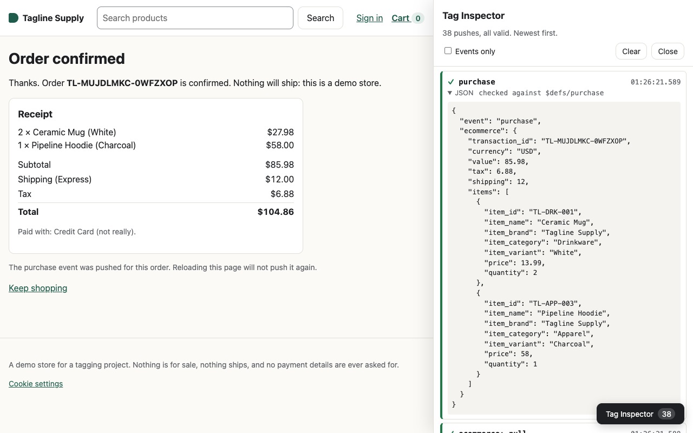
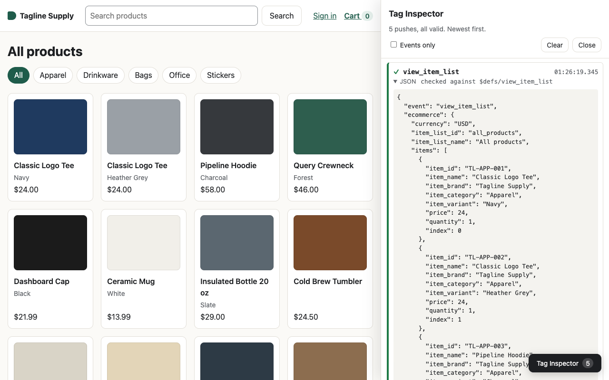
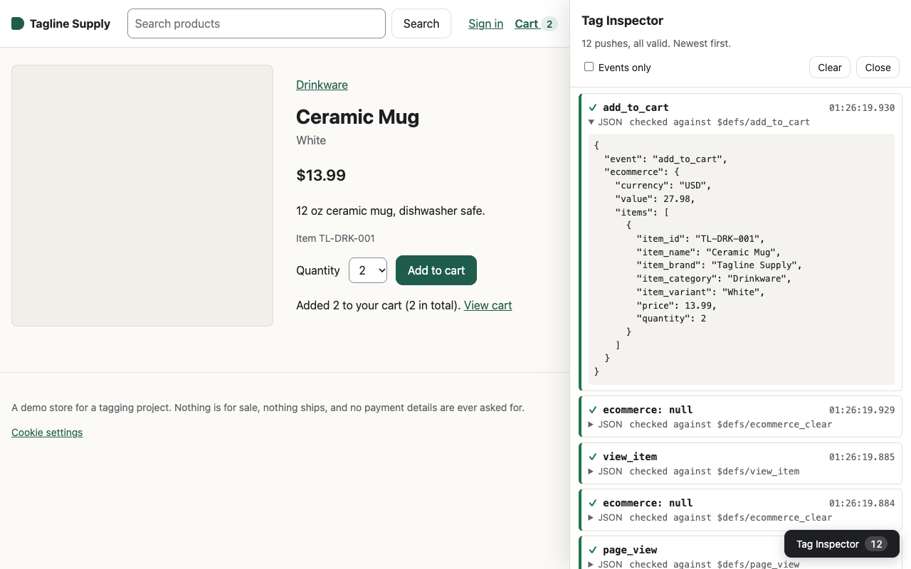
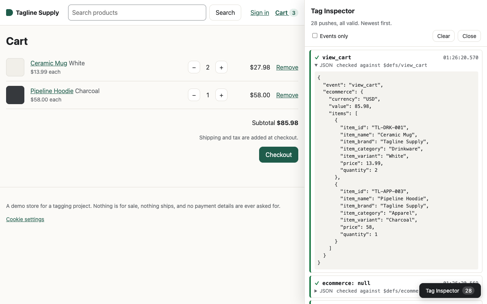
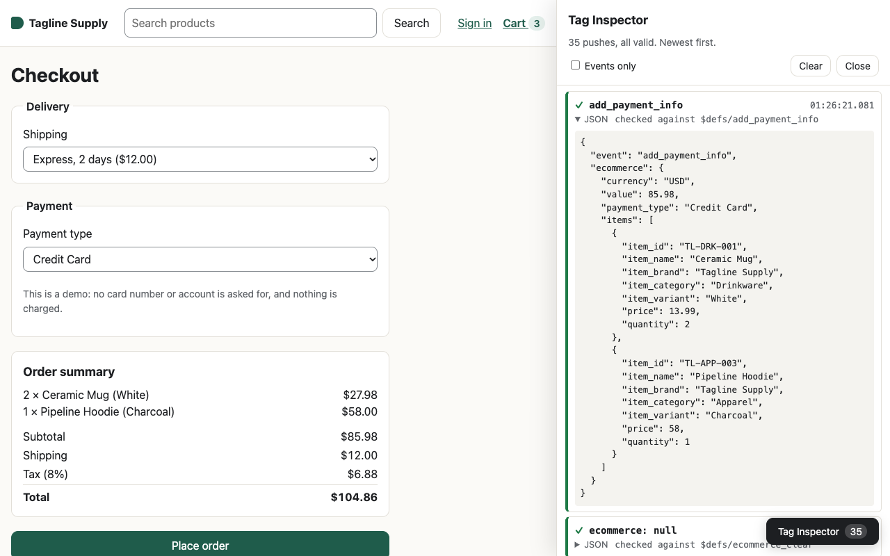
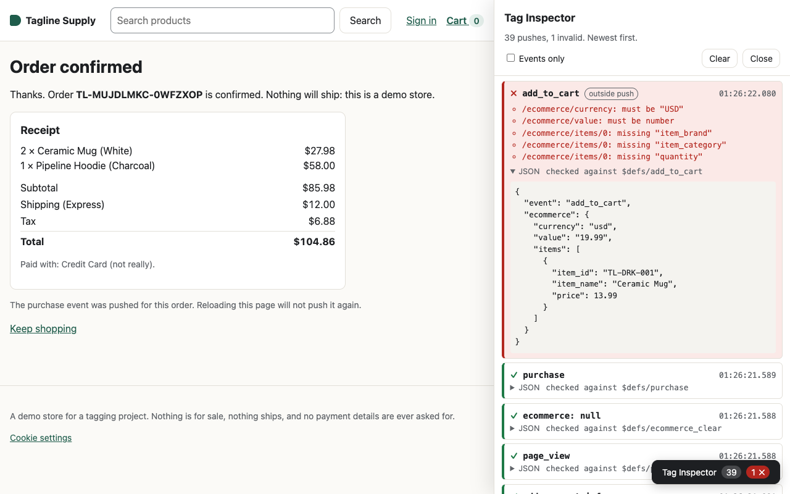
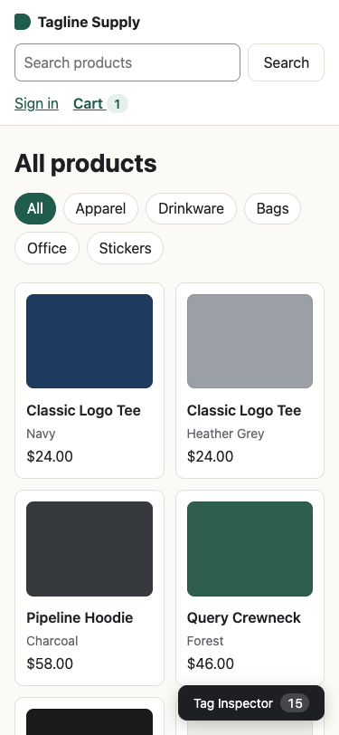

# Tagline

[](https://github.com/jdoan5/Databases-and-Data-Platforms/actions/workflows/tagline-site.yml)

Site tags to trusted KPIs on Google Cloud. A small React storefront is tagged
with GA4's recommended ecommerce events against a written, machine-checked
contract; later stages take those events through BigQuery, PySpark on Dataproc
and Airflow to KPIs, then measure what that costs and alert when the tags or the
numbers go wrong.

This folder holds Stage 1 (the tagged site, the tagging plan, and the contract) and
Stage 2 (a BigQuery pipeline that stitches and enriches GA4 export data, and a traffic
simulator for the site). Stage 2 is [below](#stage-2-stitch-and-enrich-in-bigquery).



*The confirmation page after a two-item order, with the Tag Inspector (`?debug=1`) open on the
`purchase` push. `value` is the subtotal, 2 × 13.99 + 58.00 = 85.98; tax and shipping go in their
own fields. More screenshots [below](#screenshots).*

---

## Stages

| # | Stage | What it produces | Status |
|---|---|---|---|
| 1 | Tag the site | React storefront, [tagging plan](docs/tagging-plan.md), [JSON Schema contract](tagging/events.schema.json), runtime validation with a Tag Inspector, unit and end-to-end tests | Done, pending review |
| 2 | Stitch and enrich in BigQuery | Site events unioned with the GA4 Merchandise Store sample dataset; anonymous sessions stitched to signed-in users on `user_id`; orders deduplicated, enriched with catalog cost; campaign and funnel marts; a seeded traffic simulator | Built and checked on the sample; site data waits on the GA4 link ([below](#stage-2-stitch-and-enrich-in-bigquery)) |
| 3 | PySpark on Dataproc + Airflow | The Stage 2 transforms as scheduled Spark jobs, orchestrated by Airflow | Not started |
| 4 | Cost and run-time optimization, measured | Before/after numbers for each change, including the ones that don't help | Not started |
| 5 | Tag QA and KPI alerting | The Playwright funnel grown into full tag QA against the same schema; alerts on funnel and revenue KPIs | Not started |
| 6 | Roadmap | What would change for a real store | Not started |

---

## Run Stage 1

Requires Node 24 (what CI uses) or Node 22.22+. The end-to-end test drives
the Google Chrome already installed on the machine (`channel: 'chrome'`), so
there is no Playwright browser download.

```bash
cd tagline/site
npm ci
npm run dev          # http://localhost:5173/?debug=1
npm test             # Vitest unit tests (67)
npm run e2e          # Playwright funnel test in Chrome
npm run typecheck
npm run build
```

`npm run e2e` starts its own dev server on port 5180, forces GA4 forwarding off
for that server, and stops it when the test ends, so it never runs against a dev
server you left open.

Open **http://localhost:5173/?debug=1**. `?debug=1` turns on the Tag Inspector
for the rest of the browser tab (`?debug=0` turns it off): a button in the
corner opens a drawer listing every `dataLayer` push, newest first, with the
time, ✓ or ✗ against the schema, the schema errors if any, and the JSON. It is
how you review the tags without GTM Preview or a GA4 property. Pushes typed into
the browser console are checked too and marked "outside push", so you can try
a broken event and see what the contract says about it:

```js
dataLayer.push({ event: 'add_to_cart', ecommerce: { currency: 'usd', value: '19.99', items: [] } })
// ✗ add_to_cart  /ecommerce/currency: must be "USD"
//                /ecommerce/value: must be number
//                /ecommerce/items: must NOT have fewer than 1 items
```

CI ([`tagline-site.yml`](../.github/workflows/tagline-site.yml)) runs
`npm ci`, typecheck, unit tests and the build on every push or pull request
that touches `tagline/site/` or `tagline/tagging/`. The end-to-end test runs
locally only until Stage 5.

---

## What's here

```
tagline/
  README.md
  Makefile                       make help lists every target
  .env.example                   copy to .env (gitignored): the Google Cloud project id, the site's GA4 dataset
  docs/tagging-plan.md           the plan an analyst and a developer sign off: every event, when it fires, when it must not
  docs/data-model.md             Stage 2: lineage, grain and key of every table, identity, attribution and dedupe rules
  docs/images/                   the screenshots in this README
  tagging/events.schema.json     the same contract as JSON Schema (draft 2020-12), one $defs entry per event
  site/                          Vite + React + TypeScript storefront
    src/tagging/                 builders, track(), dataLayer + gtag shim, validation, consent, identity, purchase dedupe
    src/components/TagInspector.tsx
    src/**/*.test.ts             unit tests
    e2e/funnel.spec.ts           the end-to-end funnel test
  pipeline/                      Stage 2, Python 3.12+: load reference data, build the models, run the checks
    tagline_pipeline/            CLI, config, BigQuery wrapper (cost guard, labels), cost table, reference data
    sql/models/                  one CREATE OR REPLACE per table, documented in its header
    sql/checks/                  data checks: each returns no rows when it passes
    sql/reports/                 the numbers in the Stage 2 section (make numbers)
    tests/                       pytest, and site_export_fixture.py (make fixture)
  simulator/                     Stage 2: seeded synthetic shoppers in Chrome (Playwright), dry run by default
```

The store is "Tagline Supply": 20 products in five categories (Apparel,
Drinkware, Bags, Office, Stickers), with SKUs like `TL-DRK-001`. It
deliberately resembles the Google Merchandise Store so Stage 2 can union its
events with Google's public GA4 sample. There is no backend: the cart, orders
and the fake session live in localStorage, checkout asks for a shipping tier and
a payment *type* and nothing else, and sign-in is an email field.

---

## What gets tagged

Fourteen events: thirteen of GA4's recommended events plus `page_view`, which
the site pushes itself on every page visit so each page's events have a
`page_view` in front of them; with GA4 forwarding on, GA4's own history-based
page views are turned off ([see below](#optional-forward-to-a-ga4-property)). Each
is pushed as `window.dataLayer.push({ event, ... })` in Google's GTM ecommerce
format. The full rules, with every parameter, are in
the [tagging plan](docs/tagging-plan.md); the happy path the end-to-end test
asserts, in order:

```
page_view → view_item_list → select_item → page_view → view_item → add_to_cart →
page_view → view_cart → page_view → begin_checkout → add_shipping_info →
add_payment_info → page_view → purchase
```

plus `remove_from_cart`, `search`, `login` and `sign_up`. Page code never builds
a payload: it calls a typed builder (`viewItem(product)`, `purchase(order)`) and
`track()`. Every push, including consent commands and the `{ ecommerce: null }`
clears, is validated with Ajv against `tagging/events.schema.json` before it is
pushed. An invalid push is reported (Tag Inspector, `console.warn`) and still
pushed: the validator is a monitor, not a gate, because dropping data silently
would hide the bug it exists to show.

---

## Decisions worth checking

**One `page_view` per page visit, always first.** A single-page app has no page
loads to hang page views on. The layout fires `page_view` in a layout effect
keyed on a page-visit id: layout effects run after the new page has set
`document.title` and before any page pushes `view_item_list` or `view_item` from
its passive effects, so the order holds without timers. The id is react-router's
`location.key`, except when a link to the page already shown is clicked (the
logo on home, Cart on the cart page): react-router makes that a replace with a
new key but the same URL, and it is not a new page. The once-per-page events use
the same id. The id also makes it safe under React StrictMode, which runs every
effect twice in development; the end-to-end test runs against the dev server,
StrictMode on, clicks the Cart link on the cart page, and sees exactly one of
each.

**`{ ecommerce: null }` before every ecommerce event.** GTM merges pushes into
one data model and merges nested objects and arrays instead of replacing them,
so without the clear an `add_to_cart` pushed after a three-item `view_cart` can
read back with three items. `track()` pushes the clear; a unit test checks it
goes before ecommerce events and only those, and the end-to-end test checks it
sits immediately before every ecommerce event in the funnel.

**`purchase` exactly once per `transaction_id`.** The confirmation page claims
the id in localStorage *before* pushing, so a reload, Back/Forward, a second tab
or StrictMode's second effect run finds it claimed and pushes nothing. Failing
between claim and push loses one event rather than doubling revenue. The
end-to-end test reloads the confirmation page and asserts no second purchase.
Breaking the dedupe (letting a seen id through) makes that assertion fail; the
first visit still shows one purchase, because the StrictMode guard alone covers
that case.

**`user_id` is an opaque account id, never the email.** Signing in pushes
`{ user_id }` and then `login` or `sign_up`. The id is 128 random bits, issued the
first time an email signs in or up by a stand-in for the account service a real
store has ([`accounts.ts`](site/src/auth/accounts.ts)). Nothing about the email can
be worked out from it, which is Google's User-ID rule. The email only looks the
account up, through a SHA-256 kept in this browser: it is not pushed, stored or
logged, and a unit test searches every push for it in several forms. Signing out
pushes `{ user_id: null }`, and other open tabs follow a sign-in or sign-out.

**Emails typed into search don't leak either.** The term is cleaned once at
submit (trimmed, whitespace collapsed, anything email-shaped replaced by
`[email]`, cut to GA4's 100 characters) and that cleaned term is what goes into
`search_term` *and* the `/search?q=` URL, so it cannot come back through
`page_location` or `page_title`. The `page_view` builder cleans URLs and titles
again for URLs that were typed or shared rather than submitted. The schema
rejects an email in any of those four values, raw or as `%40`.

**Consent Mode v2 through the standard gtag shim.** `gtag('consent', 'default', …)`
with all four v2 types denied is the first dataLayer entry on every load; a
stored choice is re-applied as an `update` straight after it; the banner's
Accept and Reject push an `update`. Events reach the dataLayer whatever the
choice, which is how Consent Mode is designed: it tells Google's tags how to
behave. With no measurement id configured, nothing leaves the browser; the
end-to-end test fails if any request goes anywhere but the local dev server.

---

## Optional: forward to a GA4 property

Off by default, and no measurement id is committed. To send events to your own
property, put the id in `.env.local` in the site folder (gitignored) and restart
the dev server:

```bash
echo "VITE_GA4_MEASUREMENT_ID=G-XXXXXXXXXX" > .env.local   # in tagline/site
```

The site then loads gtag.js, runs `gtag('config', id, { send_page_view: false })`
and re-sends each event as `gtag('event', name, params)` with the ecommerce
fields flattened, which is the shape gtag.js expects. Before each `page_view` it
also passes the cleaned page URL, title and referrer to gtag.js with `set`, so
gtag.js's own hits don't read an email out of the address bar. In the property's
web stream, turn off Enhanced measurement's "page changes based on browser
history events", or every route change is counted twice, and turn on data
redaction for email as a second line of defence. Site data reaches BigQuery
through GA4's own BigQuery export ([Stage 2](#the-sites-own-export-waiting-on-the-ga4-link)).

---

## Honest limitations

- **The dedupe is client-side.** It holds for reloads, Back/Forward and other
  tabs in the same browser. It cannot hold against someone clearing only the
  claim key in localStorage. GA4 also deduplicates purchases by
  `transaction_id`, and Stage 2 dedupes on it again in SQL (`fct_orders`); a
  browser can never fully guarantee once-only delivery.
- **Account ids are per browser.** A real account service returns the same id
  on every device. The stand-in keeps its directory in this browser's
  localStorage, so the same email in another browser gets a new id.
- **Validation ships to production.** Ajv and the schema add 155 KB to the
  JavaScript bundle (44 KB gzipped): 448.2 KB with them, 293.0 KB without,
  measured by stubbing the validator out of a build. Ajv also compiles the schema
  with `new Function`, so a Content-Security-Policy without `'unsafe-eval'` would
  mark every push invalid. That is a fair price for a demo whose point is showing
  the tags; a real store would validate in tests and CI and ship without Ajv.
- **The inspector sees what reaches the dataLayer, not what a tag manager does
  with it.** There is no GTM container in Stage 1, so nothing here proves how GTM
  would map these pushes to GA4 tags.
- **One Accept/Reject pair.** No per-purpose consent toggles, which a real store
  running ads should offer.
- **The end-to-end test is local-only for now.** CI runs typecheck, unit tests
  and the build; running the Playwright test in CI is part of Stage 5.

---

## Stage 2: stitch and enrich in BigQuery

Raw GA4 export rows from two sources become stitched, enriched, checked tables in
BigQuery: Google's public GA4 sample (the Google Merchandise Store, obfuscated, no
`user_id`) now, and the site's own GA4 export once GA4 is linked to BigQuery. Python
loads reference data, builds the SQL models in order and runs the checks; the modelling
is plain SQL, one file per table. The rules (grain and key of every table, identity,
attribution, dedupe, what is synthetic) are in **[docs/data-model.md](docs/data-model.md)**.

```
stg_events ─► stg_items
    │
    ├─► int_identity ─► fct_sessions ─► fct_orders ─► fct_order_items ◄─ products (+ synthetic unit_cost)
    │                        │
    │                        ├─► mart_campaign_daily ◄─ campaign_costs (synthetic)
    │                        └─► mart_funnel_daily
```

### Run Stage 2

Requires Python 3.12+ (the pipeline's venv was built with 3.14), a Google Cloud project with
BigQuery and application-default credentials (`gcloud auth application-default login`),
Node 24 or 22.22+ and Google Chrome for the simulator.

```bash
cd tagline
cp .env.example .env         # set TAGLINE_GCP_PROJECT; leave TAGLINE_GA4_DATASET empty for now
make setup                   # pipeline/.venv, npm ci in site/ and simulator/
make test                    # pytest (54) + simulator unit tests (26): no BigQuery, no browser
make reference               # tagline_raw.products and tagline_raw.campaign_costs
make build                   # every model, then every check; exits non-zero if a check fails
make numbers                 # the reconciled numbers below
make fixture                 # the site-export path, proven on temporary fake export tables (below)
make simulate                # 50 synthetic shoppers in Chrome, dry run: no hits sent to Google
make simulate-e2e            # the simulator end to end: an 8-person dry run, asserting its summary
```

The project id is read from `tagline/.env` (gitignored), so it never lands in a commit.
`tagline_raw`, `tagline_staging` and `tagline_marts` are created in the US multi-region if
missing (the sample is in the US and BigQuery cannot join across locations). Every query
job has a `maximum_bytes_billed` guard (10 GB by default), runs without the query cache so
its cost is real, and is labelled with its step for Stage 4; every read of an `events_*`
wildcard filters `_TABLE_SUFFIX` (unit-tested, as is the guard).

The commands exit 0 when done, 1 when a data check fails, 2 on a configuration error, and 3
when Google Cloud credentials are missing or expired (one line naming
`gcloud auth application-default login`) or BigQuery rejects a job; the cost table of the
jobs that ran is printed either way. `make build-dry` creates nothing, but BigQuery checks a
model against the tables it reads, so it needs a previous `make build`: it stops, with a
message, at the first model whose inputs do not exist, and later models are estimated
against the tables as last built. The package runs from source (`python -m tagline_pipeline`
in `pipeline/`, which is what `make` does).

### The sample's numbers

From `make numbers` after the last build. The checks reconcile them across tables (raw rows
to staged events, purchase events to orders, facts to marts), and `make build` fails if they
do not. The sample has no `user_id`, so every person is one device.

| | GA4 sample, 2020-11-01 to 2021-01-31 |
|---|---|
| export rows → staged events | 4,295,584 → 4,295,584 (0 exact duplicates) |
| devices = people | 270,154 |
| sessions (engaged) | 360,129 (320,096) |
| purchase events → orders | 5,692 → 5,368 (324 repeats of the same `transaction_id` on the same device dropped; 15 ids used on two devices kept as 30 orders; 450 orders have no `transaction_id` and no revenue: kept one per event, flagged, not counted as conversions) |
| sessions with an order | 4,446 |
| revenue | $340,145.00 (tax $28,164.00; the sample has no shipping) |
| revenue if purchases were not deduplicated | $362,165.00, 6.5% too high |
| funnel (closed, per session) | 360,129 → 77,020 view_item → 15,173 add_to_cart → 5,959 begin_checkout → 2,573 purchase |
| session attribution | 233,236 from the source collected at landing, 96,912 first sessions from `traffic_source`, 29,981 unknown (`(not set)`) |

### What a build costs

The last `make build` (all eight models, then the nine checks), on-demand pricing:

```
step                               kind      processed      billed    slot-ms  seconds       rows
---------------------------------  -------  ----------  ----------  ---------  -------  ---------
stg_events                         model      3.34 GiB    3.34 GiB    913,289     12.4  4,295,584
stg_items                          model      1.36 GiB    1.36 GiB    103,998      3.1  3,982,732
int_identity                       model    340.99 MiB  341.00 MiB     35,651      4.4    270,154
fct_sessions                       model      1.13 GiB    1.14 GiB    210,549      7.9    360,129
fct_orders                         model    562.64 MiB  563.00 MiB    107,045      3.2      5,368
fct_order_items                    model    376.97 MiB  377.00 MiB     42,150      2.5     15,063
mart_campaign_daily                model     20.96 MiB   21.00 MiB     93,972      3.3      2,634
mart_funnel_daily                  model      8.24 MiB   10.00 MiB     27,800      2.3         92
01_keys_unique                     check    226.00 MiB  227.00 MiB     48,740      1.1          0
02_orders_have_session_and_person  check     38.44 MiB   39.00 MiB     30,775      0.7          0
03_order_revenue_reconciles        check     99.64 MiB  100.00 MiB     13,042      0.8          0
04_marts_reconcile                 check     10.47 MiB   40.00 MiB     32,538      0.7          0
05_sample_row_counts               check     81.93 MiB   82.00 MiB      5,071      2.6          0
06_sessions_cover_events           check    330.77 MiB  331.00 MiB     23,052      0.9          0
07_identity                        check    153.86 MiB  154.00 MiB     17,208      1.2          0
08_no_email_like_strings           check    525.00 MiB  526.00 MiB      6,909      0.4          0
09_synthetic_is_labelled           check     20.00 MiB   40.00 MiB      2,095      0.6          0
---------------------------------  -------  ----------  ----------  ---------  -------  ---------
total                              17 jobs    8.57 GiB    8.62 GiB  1,713,884     48.1
```

8.62 GiB billed is about $0.05. Reading the sample into `stg_events` is 39% of it. This
table is Stage 4's baseline. Each table is partitioned by its date and some are clustered,
but at this volume none of that prunes anything (measured; see
[data-model.md](docs/data-model.md#tables-grain-key-layout)): the layout is a placeholder
for Stage 4 to decide.

### The site's own export: waiting on the GA4 link

Nothing about the site's data exists in BigQuery yet. GA4 creates the export dataset,
`analytics_<property_id>`, when the property is linked to BigQuery, and data starts flowing
only after the link exists, so the order matters:

1. **Property.** Create a GA4 property and web stream for this project. In the stream's
   Enhanced measurement, turn off "page changes based on browser history events" (the site
   sends its own `page_view`s) and turn on data redaction for email.
2. **Link.** In GA4 Admin → BigQuery links, link your project (`TAGLINE_GCP_PROJECT` in `tagline/.env`), choose the **US**
   data location (it is chosen here, when the link is made; moving it later means deleting
   the link, copying the data to a new dataset in the other region and relinking), and the
   **daily** export. Streaming is optional and costs extra.
3. **Traffic.** Only after the link exists:
   `VITE_GA4_MEASUREMENT_ID=G-XXXXXXXXXX make simulate-live` (or browse the site with
   `.env.local` set).
4. **Wait** for `events_YYYYMMDD`. Google says data starts flowing within 24 hours of the
   link, and the daily table typically lands mid-afternoon in the property's time zone,
   sometimes later or the next day.
5. **Build.** Set `TAGLINE_GA4_DATASET=analytics_<property_id>` in `tagline/.env` and run
   `make build`. The site's rows are unioned with the sample as `source = 'tagline_site'`.
   Daily tables are read; a streaming table only for a day with no daily table yet, so a day
   is never counted twice. With the variable unset, the build uses the sample alone.
6. **What to expect.** Consent-denied visitors send cookieless pings; if they arrive with no
   `user_pseudo_id` or `ga_session_id` they are in no session, and their purchases are orders
   with no session (`identity_rule` `cookieless` or `signed_in_purchase`). A day read from a
   streaming table may lack pre-consent hits' device ids until the daily table replaces it.
   The session source comes from `session_traffic_source_last_click`
   (`cross_channel_campaign` first). See [data-model.md](docs/data-model.md#identity).

**Proven before it exists.** `make fixture` (`pipeline/tests/site_export_fixture.py`) loads
hand-built rows shaped like the site's export into temporary tables in `tagline_raw`, named as
GA4 names them behind a `fake_ga4_` prefix (`fake_ga4_events_20260924`, …; no extra dataset,
each table labelled `purpose:fixture` and expiring after 24 hours), builds everything with the
site export pointed at them, runs the checks and eleven scenario checks, rebuilds without them,
and deletes them. While it runs, `tagline_staging` and `tagline_marts` hold the fixture build;
if the rebuild fails it says so, and `make build` puts the real tables back. The schema is the
public sample's plus the traffic-source records current exports have and the sample predates
(`collected_traffic_source`, `session_traffic_source_last_click` with `cross_channel_campaign`).
The last run:

| Scenario | Result |
|---|---|
| both sources in `stg_events`; one planted exact-duplicate row collapsed; the streaming copy of a day that has its daily table ignored; a streaming-only day read | 4,295,584 sample + 66 daily + 7 streaming site events (67 daily rows read) |
| device A: an anonymous session from a `google / cpc / fall_launch` click with a gclid and no utm_*, named only by `cross_channel_campaign`; next day a `facebook / paid_social / retarget_q4` visit where it signs up | the day-1 session is attributed to `fall_launch` from `cross_channel_campaign`; all 12 anonymous events on A belong to the person; the day-1 session is `device_user_id` |
| device B: lands from `newsletter / email / newsletter_oct`, logs in to the same account, buys | same person (`person_device_count = 2`); the order is the account's (`signed_in_purchase`) |
| the purchase sent twice with one `transaction_id` | 2 events, 1 order, revenue $61.00 once |
| campaign attributed and costed | the order sits on the newsletter row of `mart_campaign_daily`: 1 session, 1 order, $61.00 revenue, $8.70 synthetic cost, ROAS 7.01 |
| order lines enriched with the catalog | every line matched to `products`, synthetic cost and gross margin computed |
| a laptop used by two accounts, then anonymously | kept apart: each signed-in session to its account, the anonymous one to the device (`shared_device`) |
| consent denied: 12 cookieless events with no `user_pseudo_id` or `ga_session_id`, two of them purchases, one signed in | in no session and not in `int_identity`; both purchases are orders with no session: one `cookieless` (a per-order anonymous person), one `signed_in_purchase` (person V) |

All nine checks passed with the fixture in and again after the rebuild without it; no
`tagline_site` row was left; the four fixture tables were deleted. A run is two full builds:
50 jobs, 17.48 GiB billed, about $0.10.

### Traffic simulator

`tagline/simulator` drives the real site in Chrome (Playwright with `channel: 'chrome'`, the
browser already installed; no browser download) with seeded synthetic journeys, so the site's
GA4 property has something to export. 50 people by default, each on 1 to 3 devices (a fresh
browser context each, so a separate GA4 client id); landings from three campaigns
(`fall_launch` google / cpc, `newsletter_oct` newsletter / email, `retarget_q4` facebook /
paid_social, the same triples as `campaign_costs`), organic and direct; journeys that bounce,
browse, abandon a cart or checkout, or buy; sign-ups on one device and logins on others; most
accept consent, some reject or ignore the banner. `retarget_q4` only brings people back on a
later device, never as their first visit (a retargeting ad needs an earlier visit). The site's stand-in account service keeps
its directory per browser, so before a device signs in the simulator writes that person's
entry into the fresh context, playing the backend a real store has: the same person gets the
same account id on every device. Two people deliberately paste their email into search or
arrive on a newsletter link that carries it, to prove the site keeps it out of every hit.

`make simulate-plan` prints the plan without a browser. Same seed, same plan; `--population`
fixes who the customers are, so separate runs bring the same signed-in customers back.

**Dry run (the default)** builds the site with a fake measurement id, lets gtag.js load, and
intercepts every request to Google: each `/g/collect` hit is recorded, parsed (batched
bodies included) and answered locally with a 204; everything else is aborted; the dry-run
browser cannot even resolve Google's collection hosts. No hit reaches Google, but gtag.js
itself is downloaded from `www.googletagmanager.com` once per run (with the fake id
`G-DRYRUN0000`). The summary checks every device against its plan. The last 50-person run
(226 s, headless):

| | |
|---|---|
| devices, hits | 68 devices, 281 `/g/collect` requests, 1,075 hits, 68 client ids; every request line parsed |
| attribution | every campaign device's first hit carries its landing page's utm_* in `dl` (33 of 33); organic and direct read as such |
| identity | 23 people signed in; `uid` on 310 hits from 37 devices, always the person's 32-hex account id and never before the sign-in; 11 of 11 people who signed in on two or more devices carry one `uid` under two or more client ids |
| consent | 48 devices planned to accept, 8 reject, 12 ignore; no rejecting or ignoring device sent a granted hit; 675 hits granted (G111), 400 denied (G100), and 5 of the 13 purchases were sent denied (cookieless pings: [data-model.md](docs/data-model.md#identity) says how the model keeps them). 3 accepting devices bounced right after accepting, so they sent no granted hit (reported as warnings) |
| orders | 13 planned, 13 purchase hits, 13 distinct `transaction_id`s |
| personal data | none of the 281 intercepted requests contains an email (raw or encoded) or a simulated person's email; the emailed search terms went out as `[email]`, the newsletter link's `subscriber=` as `subscriber=%5Bemail%5D` |
| leaks | 0 Google requests completed |

Every campaign in the hits is in `tagline_raw.campaign_costs` (checked against the table, and
by a unit test against `plan.js`).

*Dry run: why hits are answered, not aborted.* An aborted `/g/collect` request is not what
happens in real life, and gtag.js reacts to it: `--abort-collect` keeps the abort, and a
6-person run with it saw gtag.js retry every hit at `www.google.com/g/collect` (34 of 69
requests), so every event went out twice, and never send the purchases (0 of 2 planned). Answering
with the 204 Google's endpoint returns keeps gtag.js behaving as it does against GA4.

**Live mode** (`make simulate-live`, with `VITE_GA4_MEASUREMENT_ID=G-...` in the environment)
sends the same synthetic traffic to a real property after a 10-second countdown. Everything
it sends is synthetic: made-up people, journeys and orders on `localhost`. Use a property made
for this project. Removing it later takes a GA4 data-deletion request, and rows already
exported stay in BigQuery until deleted there.

*Will GA4 count it?* Google excludes known bots and spiders automatically, identified by
"a combination of Google research and the International Spiders and Bots List" (IAB), and
the exclusion cannot be turned off or measured
([GA4 help](https://support.google.com/analytics/answer/9888366)). Headless Chrome announces
itself: its user agent says `HeadlessChrome/154.0.0.0` (checked on this machine). So live
mode runs **headed** Chrome by default. The simulator does not change the user agent or
hide automation (`navigator.webdriver` is still true), and if GA4 filters the headed traffic
too, the answer is to accept that, not to disguise it. Whether GA4 counts it is unknown until
the property exists.

### What is synthetic

Product unit costs (a documented margin per category plus seeded jitter) and all campaign
spend (`campaign_costs`, seeded; sample budgets sized from the sample's own traffic at an
invented price per session) are flagged in their tables (`cost_is_synthetic`,
`is_synthetic`) and descriptions, and check 09 fails if not. Every simulated visit, order and
account, and so every `source = 'tagline_site'` row once the export exists, is synthetic too,
but that is labelled only here, in [data-model.md](docs/data-model.md#what-is-synthetic) and
in the simulator's live-mode banner: no column flags it. The fixture's rows live only in
temporary tables whose descriptions say so. The sample's revenue is itself obfuscated, so
ROAS on it demonstrates the join, not anything about Google's campaigns.

### Stage 2 limitations

- **Stitching is only shown on fixture data.** The sample has no `user_id`, and the site's
  export does not exist yet. The fixture proves the rules on rows shaped like the export; real
  GA4 processing (sessionization, consent-denied pings, attribution carried across visits)
  will only be seen once the property is live.
- **Consent-denied activity joins a person when it carries a `user_id`.** That follows the
  tagging plan's §8 choice to send `user_id` whatever the consent state, which is accepted for
  this demo and still marked *Needs sign-off*; if the sign-off goes the other way, denied
  sessions need their own identity rule.
- **Session attribution differs by source.** Site sessions use GA4's own
  `session_traffic_source_last_click`; sample sessions use the source collected at landing,
  then `traffic_source` for a device's first session, else `(not set)`, because the sample
  predates that field and records no source on `session_start`. The two are not strictly
  comparable.
- **Shared devices are not guessed.** A browser used by two accounts keeps its anonymous
  sessions anonymous rather than giving them to either person.
- **Orders without a `transaction_id` cannot be deduplicated** (450 in the sample, all with no
  revenue); each is kept once per event, flagged, and not counted as a conversion.
- **The simulator's traffic is small and uniform**: one machine, one user agent, `localhost`,
  window sizes standing in for devices. It exercises the tags, the campaign join, sign-in
  across devices and consent, but not every path the model handles: every device is a fresh
  browser with exactly one session (so no `ga_session_number` above 1, no returning device,
  no earlier anonymous session on the same browser before a sign-in, and no campaign carried
  across visits), and a whole run takes a few minutes on one date. Those paths are covered
  only by the fixture.

Stage 2 changed no Stage 1 code, tag or contract file. In this README's Stage 1 sections, only
the unit-test count (66 → 67, what `npm test` runs today) and two forward references to Stage 2
changed.

---

## Screenshots

Taken with headless Chrome against the dev server, `?debug=1`, 1280 px wide
unless noted.

| | |
|---|---|
|  |  |
| **Home.** Consent default, the stored consent choice, `page_view`, then one `view_item_list` with all 20 products and their `index`. | **Product.** `add_to_cart` for two mugs: `quantity` 2, `value` 27.98, preceded by `{ ecommerce: null }`. |
|  |  |
| **Cart.** `view_cart` with both lines; `value` is the subtotal, 85.98. | **Checkout.** `add_payment_info` after a shipping tier was chosen. No payment details exist anywhere in the site. |
|  |  |
| **An invalid push.** A broken `add_to_cart` typed into the console: ✗, the schema errors, and the "outside push" label. | **375 px wide.** Two product columns, the Tag Inspector button in the corner. |

