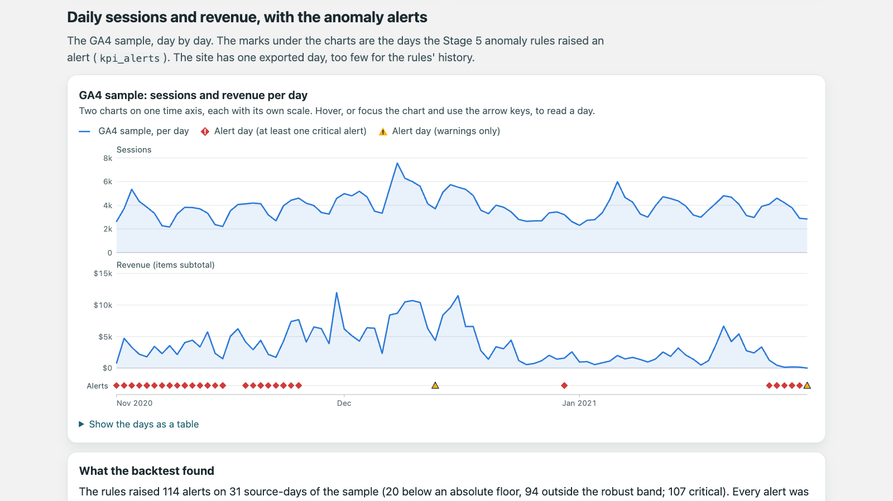

# Tagline

[](https://github.com/jdoan5/Databases-and-Data-Platforms/actions/workflows/tagline-site.yml)
[](https://github.com/jdoan5/Databases-and-Data-Platforms/actions/workflows/tagline-tagqa.yml)
[](https://github.com/jdoan5/Databases-and-Data-Platforms/actions/workflows/tagline-pipeline.yml)

Site tags to trusted KPIs on Google Cloud, in six stages. A small React storefront is tagged
with GA4's recommended ecommerce events against a written, machine-checked contract. Its GA4
export and Google's public GA4 sample go through BigQuery, PySpark on Dataproc and Airflow to KPIs
and multi-touch attribution. What a run costs is measured and cut, tag QA and anomaly alerts watch
the tags and the numbers, and a roadmap and a dashboard make it something a team could run.

**Dashboard:** [jdoan5.github.io/tagline](https://jdoan5.github.io/tagline/), a static page over a
snapshot of the marts ([dashboard/README.md](dashboard/README.md)). **Roadmap:** [ROADMAP.md](ROADMAP.md).

Two sources, labelled wherever their numbers appear: Google's GA4 sample is real store traffic,
obfuscated by Google, so its revenue shows the pipeline working, not how Google's store did; the
site's own export is one day of simulated shoppers.

| Stage | Headline numbers |
|---|---|
| 1. [Tag the site](#what-gets-tagged) | 14 events, each validated against a JSON Schema contract as it fires and shown in a Tag Inspector; `user_id` is an opaque account id, never the email; 67 unit tests and a Playwright funnel test |
| 2. [Stitch and enrich in BigQuery](#stage-2-stitch-and-enrich-in-bigquery) | the sample's 4,295,584 events into 360,129 sessions and 4,918 orders that count as conversions, $340,145.00 (5,368 with the 450 zero-value purchases that have no `transaction_id`; without the purchase dedupe, revenue reads 6.5% high); on the site's export, 8 people stitched across 17 devices |
| 3. [Attribution in Spark, run by Airflow](#stage-3-attribution-in-spark-orchestrated-by-airflow) | every order credited under six models, reconciling to Stage 2 to the cent; the store's self-referral has 17.0% of last-click revenue and 4.0% of first-click (orders with a complete 30-day lookback) |
| 4. [Cheaper and faster, measured](#stage-4-cheaper-and-faster-measured) | a daily DAG run from 480 s and $0.081 to 249 s and $0.019, BigQuery billed −75%, outputs identical but for two documented last-bit sums |
| 5. [Guard the data](#stage-5-guard-the-data) | a 46-test tag QA suite, in CI, fails on 12 of 12 deliberate tag breaks; the anomaly rules, backtested on 92 days, raised 114 alerts in 12 incidents, all but one from six real problems in the sample |
| 6. [Run it like a product](#stage-6-run-it-like-a-product) | a roadmap of 26 RICE-scored items, each traced to a finding of Stages 1–5; three issue forms for requests; a decision log; the dashboard, from a 71 KB snapshot that cost 6 queries and 60 MiB |

Docs: [tagging plan](docs/tagging-plan.md) · [data model](docs/data-model.md) ·
[orchestration](docs/orchestration.md) · [attribution rules](spark/README.md) ·
[Stage 4 results](STAGE4-RESULTS.md) · [tag QA](docs/tag-qa.md) · [monitoring](docs/monitoring.md) ·
[roadmap](ROADMAP.md) · [dashboard](dashboard/README.md)



*The dashboard's daily chart: the GA4 sample's sessions and revenue per day, on one time axis, and
under them the days the Stage 5 anomaly rules raised an alert. More screenshots [below](#screenshots).*

---

## Stages

| # | Stage | What it produces | Status |
|---|---|---|---|
| 1 | Tag the site | React storefront, [tagging plan](docs/tagging-plan.md), [JSON Schema contract](tagging/events.schema.json), runtime validation with a Tag Inspector, unit and end-to-end tests | Done: 14 events, 67 unit tests, the funnel test in CI since Stage 5. One decision in the plan, `user_id` under denied consent (§8), still needs a sign-off ([ROADMAP](ROADMAP.md#now), item 1) |
| 2 | Stitch and enrich in BigQuery | Site events unioned with the GA4 Merchandise Store sample dataset; anonymous sessions stitched to signed-in users on `user_id`; orders deduplicated, enriched with catalog cost; campaign and funnel marts; a seeded traffic simulator | Done: built and checked on the sample and on the site's own GA4 export (one day of simulated traffic, 1,433 events; [below](#the-sites-own-export)) |
| 3 | PySpark on Dataproc + Airflow | Multi-touch attribution: every order credited across the buyer's 30-day journey under six models, in PySpark on Dataproc Serverless; the Stage 2 SQL build, its checks, the Spark job and checks on its output as one daily Airflow DAG, run locally in Docker | Done: built and run end to end on the sample and the site's export, on the pinned Dataproc runtime 3.0, with cross-device journeys from the site ([below](#stage-3-attribution-in-spark-orchestrated-by-airflow)) |
| 4 | Cost and run-time optimization, measured | Nine experiments, each kept or reverted on its numbers: a daily incremental BigQuery build (one script, one transaction, identical to a full build on every step of its equivalence test), narrower reads, a measured table layout, a storage recommendation; the Spark batch out of one-thread local mode, down to 4 partitions and the smallest driver; the harness and every run's record in [`bench/results/`](bench/results/) | Done: a daily DAG run 249 s and $0.019 against 480 s and $0.081, outputs identical but for two documented last-bit sums ([below](#stage-4-cheaper-and-faster-measured), [STAGE4-RESULTS.md](STAGE4-RESULTS.md)) |
| 5 | Tag QA and KPI alerting | Tag QA: a 9-journey test plan, 10 rules, golden dataLayer snapshots and a GA4 hit layer against a fake measurement id, in CI ([tag-qa.md](docs/tag-qa.md)); a daily tag-health mart with its checks generated from the contract, a daily KPI mart, and anomaly alerts on both (missing days and vanished events included), backtested on the sample's 92 days, delivered to a webhook or the log from the DAG ([monitoring.md](docs/monitoring.md)) | Done: 12 of 12 mutations of the site's tags fail the suite; the backtest flags six real problems in the sample with one noise incident; the DAG green end to end with the new tasks ([below](#stage-5-guard-the-data)) |
| 6 | Run it like a product | [ROADMAP.md](ROADMAP.md): who the data serves and the decisions it supports, intake through three GitHub issue forms, RICE with its scale defined, a scored backlog in Now / Next / Later, what would change for a real store, a decision log; a static dashboard over a JSON snapshot of the marts, published on the portfolio site ([dashboard/README.md](dashboard/README.md)) | Done: 26 backlog items, each citing the doc and section behind it; the snapshot validated against a JSON Schema and a privacy scan; the page checked in Chrome at 1280 and 375 px ([below](#stage-6-run-it-like-a-product)) |

---

## Run Stage 1

Requires Node 24 (what CI uses) or Node 22.22+. The end-to-end test drives
the Google Chrome already installed on the machine (`channel: 'chrome'`), so
there is no Playwright browser download.

```bash
cd tagline/site
npm ci
npm run dev          # http://localhost:5173/?debug=1
npm test             # Vitest unit tests (67)
npm run e2e          # Playwright funnel test in Chrome
npm run tagqa        # Stage 5: the whole tag QA suite (46 tests, about 46 s; docs/tag-qa.md)
npm run tagqa:update # Stage 5: rewrite the golden dataLayer snapshots on purpose
npm run typecheck
npm run build
```

`npm run e2e` starts its own dev server on port 5180, forces GA4 forwarding off
for that server, and stops it when the test ends, so it never runs against a dev
server you left open.

Open **http://localhost:5173/?debug=1**. `?debug=1` turns on the Tag Inspector
for the rest of the browser tab (`?debug=0` turns it off): a button in the
corner opens a drawer listing every `dataLayer` push, newest first, with the
time, ✓ or ✗ against the schema, the schema errors if any, and the JSON. It is
how you review the tags without GTM Preview or a GA4 property. Pushes typed into
the browser console are checked too and marked "outside push", so you can try
a broken event and see what the contract says about it:

```js
dataLayer.push({ event: 'add_to_cart', ecommerce: { currency: 'usd', value: '19.99', items: [] } })
// ✗ add_to_cart  /ecommerce/currency: must be "USD"
//                /ecommerce/value: must be number
//                /ecommerce/items: must NOT have fewer than 1 items
```

CI ([`tagline-site.yml`](../.github/workflows/tagline-site.yml)) runs
`npm ci`, typecheck, unit tests and the build on every push or pull request
that touches `tagline/site/` or `tagline/tagging/`. Since Stage 5 the
end-to-end test runs in CI too, with the rest of the tag QA suite, on
Playwright's Chromium ([`tagline-tagqa.yml`](../.github/workflows/tagline-tagqa.yml)).

---

## What's here

```
tagline/
  README.md
  STAGE4-RESULTS.md              Stage 4: every experiment, its numbers, kept or reverted, and the final runs
  ROADMAP.md                     Stage 6: who the data serves, intake, RICE, the scored backlog, a real store, the decision log
  Makefile                       make help lists every target
  .env.example                   copy to .env (gitignored): the Google Cloud project id, the site's GA4 dataset, the cost guard;
                                 for Stage 3 the Dataproc region, bucket and service account; for Stage 5 the alert webhook
  docs/tagging-plan.md           the plan an analyst and a developer sign off: every event, when it fires, when it must not
  docs/data-model.md             Stage 2: lineage, grain and key of every table, identity, attribution and dedupe rules
  docs/orchestration.md          Stage 3: the DAG, running Airflow locally, cost guards, measured runs, why not Composer
  docs/tag-qa.md                 Stage 5: the tag QA suite, its rules and goldens, the GA4 hit layer, the mutation runs, CI
  docs/monitoring.md             Stage 5: tag health and KPI marts, the anomaly rules, the backtest, delivery
  docs/images/                   the screenshots in this README
  tagging/events.schema.json     the same contract as JSON Schema (draft 2020-12), one $defs entry per event
  site/                          Vite + React + TypeScript storefront
    src/tagging/                 builders, track(), dataLayer + gtag shim, validation, consent, identity, purchase dedupe
    src/components/TagInspector.tsx
    src/**/*.test.ts             unit tests
    e2e/funnel.spec.ts           the end-to-end funnel test
    tagqa/                       Stage 5: the tag test plan (plan.ts), rules, golden diff, journey runner, GA4 hit checks,
                                 the golden snapshots (golden/*.json) and the specs; playwright.tagqa.config.ts runs them
  pipeline/                      Stage 2, Python 3.12+: load reference data, build the models, run the checks
    tagline_pipeline/            CLI, config, BigQuery wrapper (cost guard, labels), cost table, reference data;
                                 Stage 5: contract.py (tag health SQL generated from the contract), anomaly.py (the rules,
                                 pure Python), alerts.py (kpi_alerts and delivery)
    monitoring.toml              Stage 5: every anomaly threshold, in one file
    sql/models/                  one CREATE OR REPLACE per table, documented in its header (Stage 5: 85_mart_kpi_daily,
                                 90_mart_tag_health_daily)
    sql/checks/                  data checks: each returns no rows when it passes (Stage 5: 10 and 11, on the two marts)
    sql/reports/                 the numbers in the Stage 2 section (make numbers)
    tests/                       pytest, and site_export_fixture.py (make fixture); fixtures/: the sample's two
                                 monitoring marts, for the backtest and injected-anomaly tests
  simulator/                     Stage 2: seeded synthetic shoppers in Chrome (Playwright), dry run by default
  spark/                         Stage 3: the attribution job (pure DataFrame functions, their pytest, the Dataproc entrypoint);
                                 tagline_spark/: the one batch definition make and the DAG submit; spark/README.md
  airflow/                       Stage 3: docker-compose for Airflow 3, the tagline_daily DAG, its DagBag test
    dags/tagline_daily.py        the DAG; helpers in dags/tagline_airflow/, the attribution checks in its sql/
  bench/                         Stage 4: the measurement harness (make bench-*), its tests, and the results log in results/
  dashboard/                     Stage 6: the snapshot exporter, data/snapshot.json, the static page, its schema and tests
../.github/ISSUE_TEMPLATE/       Stage 6: the three request forms (tagline-data-request, tagline-tag-change, tagline-data-bug)
```

The store is "Tagline Supply": 20 products in five categories (Apparel,
Drinkware, Bags, Office, Stickers), with SKUs like `TL-DRK-001`. It
deliberately resembles the Google Merchandise Store so Stage 2 can union its
events with Google's public GA4 sample. There is no backend: the cart, orders
and the fake session live in localStorage, checkout asks for a shipping tier and
a payment *type* and nothing else, and sign-in is an email field.

---

## What gets tagged

Fourteen events: thirteen of GA4's recommended events plus `page_view`, which
the site pushes itself on every page visit so each page's events have a
`page_view` in front of them; with GA4 forwarding on, GA4's own history-based
page views are turned off ([see below](#optional-forward-to-a-ga4-property)). Each
is pushed as `window.dataLayer.push({ event, ... })` in Google's GTM ecommerce
format. The full rules, with every parameter, are in
the [tagging plan](docs/tagging-plan.md); the happy path the end-to-end test
asserts, in order:

```
page_view → view_item_list → select_item → page_view → view_item → add_to_cart →
page_view → view_cart → page_view → begin_checkout → add_shipping_info →
add_payment_info → page_view → purchase
```

plus `remove_from_cart`, `search`, `login` and `sign_up`. Page code never builds
a payload: it calls a typed builder (`viewItem(product)`, `purchase(order)`) and
`track()`. Every push, including consent commands and the `{ ecommerce: null }`
clears, is validated with Ajv against `tagging/events.schema.json` before it is
pushed. An invalid push is reported (Tag Inspector, `console.warn`) and still
pushed: the validator is a monitor, not a gate, because dropping data silently
would hide the bug it exists to show.

---

## Decisions worth checking

**One `page_view` per page visit, always first.** A single-page app has no page
loads to hang page views on. The layout fires `page_view` in a layout effect
keyed on a page-visit id: layout effects run after the new page has set
`document.title` and before any page pushes `view_item_list` or `view_item` from
its passive effects, so the order holds without timers. The id is react-router's
`location.key`, except when a link to the page already shown is clicked (the
logo on home, Cart on the cart page): react-router makes that a replace with a
new key but the same URL, and it is not a new page. The once-per-page events use
the same id. The id also makes it safe under React StrictMode, which runs every
effect twice in development; the end-to-end test runs against the dev server,
StrictMode on, clicks the Cart link on the cart page, and sees exactly one of
each.

**`{ ecommerce: null }` before every ecommerce event.** GTM merges pushes into
one data model and merges nested objects and arrays instead of replacing them,
so without the clear an `add_to_cart` pushed after a three-item `view_cart` can
read back with three items. `track()` pushes the clear; a unit test checks it
goes before ecommerce events and only those, and the end-to-end test checks it
sits immediately before every ecommerce event in the funnel.

**`purchase` exactly once per `transaction_id`.** The confirmation page claims
the id in localStorage *before* pushing, so a reload, Back/Forward, a second tab
or StrictMode's second effect run finds it claimed and pushes nothing. Failing
between claim and push loses one event rather than doubling revenue. The
end-to-end test reloads the confirmation page and asserts no second purchase.
Breaking the dedupe (letting a seen id through) makes that assertion fail; the
first visit still shows one purchase, because the StrictMode guard alone covers
that case.

**`user_id` is an opaque account id, never the email.** Signing in pushes
`{ user_id }` and then `login` or `sign_up`. The id is 128 random bits, issued the
first time an email signs in or up by a stand-in for the account service a real
store has ([`accounts.ts`](site/src/auth/accounts.ts)). Nothing about the email can
be worked out from it, which is Google's User-ID rule. The email only looks the
account up, through a SHA-256 kept in this browser: it is not pushed, stored or
logged, and a unit test searches every push for it in several forms. Signing out
pushes `{ user_id: null }`, and other open tabs follow a sign-in or sign-out.

**Emails typed into search don't leak either.** The term is cleaned once at
submit (trimmed, whitespace collapsed, anything email-shaped replaced by
`[email]`, cut to GA4's 100 characters) and that cleaned term is what goes into
`search_term` *and* the `/search?q=` URL, so it cannot come back through
`page_location` or `page_title`. The `page_view` builder cleans URLs and titles
again for URLs that were typed or shared rather than submitted. The schema
rejects an email in any of those four values, raw or as `%40`.

**Consent Mode v2 through the standard gtag shim.** `gtag('consent', 'default', …)`
with all four v2 types denied is the first dataLayer entry on every load; a
stored choice is re-applied as an `update` straight after it; the banner's
Accept and Reject push an `update`. Events reach the dataLayer whatever the
choice, which is how Consent Mode is designed: it tells Google's tags how to
behave. With no measurement id configured, nothing leaves the browser; the
end-to-end test fails if any request goes anywhere but the local dev server.

---

## Optional: forward to a GA4 property

Off by default, and no measurement id is committed. To send events to your own
property, put the id in `.env.local` in the site folder (gitignored) and restart
the dev server:

```bash
echo "VITE_GA4_MEASUREMENT_ID=G-XXXXXXXXXX" > .env.local   # in tagline/site
```

The site then loads gtag.js, runs `gtag('config', id, { send_page_view: false })`
and re-sends each event as `gtag('event', name, params)` with the ecommerce
fields flattened, which is the shape gtag.js expects. Before each `page_view` it
also passes the cleaned page URL, title and referrer to gtag.js with `set`, so
gtag.js's own hits don't read an email out of the address bar. In the property's
web stream, turn off Enhanced measurement's "page changes based on browser
history events", or every route change is counted twice, and turn on data
redaction for email as a second line of defence. Site data reaches BigQuery
through GA4's own BigQuery export ([Stage 2](#the-sites-own-export)).

---

## Honest limitations

- **The dedupe is client-side.** It holds for reloads, Back/Forward and other
  tabs in the same browser. It cannot hold against someone clearing only the
  claim key in localStorage. GA4 also deduplicates purchases by
  `transaction_id`, and Stage 2 dedupes on it again in SQL (`fct_orders`); a
  browser can never fully guarantee once-only delivery.
- **Account ids are per browser.** A real account service returns the same id
  on every device. The stand-in keeps its directory in this browser's
  localStorage, so the same email in another browser gets a new id.
- **Validation ships to production.** Ajv and the schema add 155 KB to the
  JavaScript bundle (44 KB gzipped): 448.2 KB with them, 293.0 KB without,
  measured by stubbing the validator out of a build. Ajv also compiles the schema
  with `new Function`, so a Content-Security-Policy without `'unsafe-eval'` would
  mark every push invalid. That is a fair price for a demo whose point is showing
  the tags; a real store would validate in tests and CI and ship without Ajv.
- **The inspector sees what reaches the dataLayer, not what a tag manager does
  with it.** There is no GTM container in Stage 1, so nothing here proves how GTM
  would map these pushes to GA4 tags.
- **One Accept/Reject pair.** No per-purpose consent toggles, which a real store
  running ads should offer.
- **The end-to-end test was local-only in Stage 1.** Stage 5 put it in CI
  with the tag QA suite ([`tagline-tagqa.yml`](../.github/workflows/tagline-tagqa.yml)),
  which has since passed on GitHub's runners (46 of 46 on 2026-09-30).

---

## Stage 2: stitch and enrich in BigQuery

Raw GA4 export rows from two sources become stitched, enriched, checked tables in
BigQuery: Google's public GA4 sample (the Google Merchandise Store, obfuscated, no
`user_id`) and the site's own GA4 export (one day so far, the simulator's traffic). Python
loads reference data, builds the SQL models in order and runs the checks; the modelling
is plain SQL, one file per table. The rules (grain and key of every table, identity,
attribution, dedupe, what is synthetic) are in **[docs/data-model.md](docs/data-model.md)**.

```
stg_events ─► stg_items
    │
    ├─► int_identity ─► fct_sessions ─► fct_orders ─► fct_order_items ◄─ products (+ synthetic unit_cost)
    │                        │
    │                        ├─► mart_campaign_daily ◄─ campaign_costs (synthetic)
    │                        └─► mart_funnel_daily
```

### Run Stage 2

Requires Python 3.12+ (the pipeline's venv was built with 3.14), a Google Cloud project with
BigQuery and application-default credentials (`gcloud auth application-default login`),
Node 24 or 22.22+ and Google Chrome for the simulator.

```bash
cd tagline
cp .env.example .env         # set TAGLINE_GCP_PROJECT; TAGLINE_GA4_DATASET once the site's export exists
make setup                   # pipeline/.venv, npm ci in site/ and simulator/
make test                    # pytest (125 since Stage 5) + simulator unit tests (26): no BigQuery, no browser
make reference               # tagline_raw.products and tagline_raw.campaign_costs
make build                   # every model, then every check; exits non-zero if a check fails
make build-incremental       # the daily path (Stage 4): only new or changed export days, one script, then the checks
make numbers                 # the reconciled numbers below
make fixture                 # the site-export path, proven on temporary fake export tables (below)
make simulate                # 50 synthetic shoppers in Chrome, dry run: no hits sent to Google
make simulate-e2e            # the simulator end to end: an 8-person dry run, asserting its summary
```

The project id is read from `tagline/.env` (gitignored), so it never lands in a commit.
`tagline_raw`, `tagline_staging` and `tagline_marts` are created in the US multi-region if
missing (the sample is in the US and BigQuery cannot join across locations). Every query
job has a `maximum_bytes_billed` guard (10 GB by default), runs without the query cache so
its cost is real, and is labelled with its step for Stage 4; every read of an `events_*`
wildcard filters `_TABLE_SUFFIX` (unit-tested, as is the guard).

The commands exit 0 when done, 1 when a data check fails, 2 on a configuration error, and 3
when Google Cloud credentials are missing or expired (one line naming
`gcloud auth application-default login`) or BigQuery rejects a job; the cost table of the
jobs that ran is printed either way. `make build-dry` creates nothing, but BigQuery checks a
model against the tables it reads, so it needs a previous `make build`: it stops, with a
message, at the first model whose inputs do not exist, and later models are estimated
against the tables as last built. The package runs from source (`python -m tagline_pipeline`
in `pipeline/`, which is what `make` does).

### The sample's numbers

From `make numbers` after the last build. The checks reconcile them across tables (raw rows
to staged events, purchase events to orders, facts to marts), and `make build` fails if they
do not. The sample has no `user_id`, so every person is one device.

| | GA4 sample, 2020-11-01 to 2021-01-31 |
|---|---|
| export rows → staged events | 4,295,584 → 4,295,584 (0 exact duplicates) |
| devices = people | 270,154 |
| sessions (engaged) | 360,129 (320,096) |
| purchase events → orders | 5,692 → 5,368 (324 repeats of the same `transaction_id` on the same device dropped; 15 ids used on two devices kept as 30 orders; 450 orders have no `transaction_id` and no revenue: kept one per event, flagged, not counted as conversions) |
| sessions with an order | 4,446 |
| revenue | $340,145.00 (tax $28,164.00; the sample has no shipping) |
| revenue if purchases were not deduplicated | $362,165.00, 6.5% too high |
| funnel (closed, per session) | 360,129 → 77,020 view_item → 15,173 add_to_cart → 5,959 begin_checkout → 2,573 purchase |
| session attribution | 233,236 from the source collected at landing, 96,912 first sessions from `traffic_source`, 29,981 unknown (`(not set)`) |

### What a build costs

The last `make build` on the sample alone (all eight models, then the nine checks), on-demand pricing:

```
step                               kind      processed      billed    slot-ms  seconds       rows
---------------------------------  -------  ----------  ----------  ---------  -------  ---------
stg_events                         model      3.34 GiB    3.34 GiB    913,289     12.4  4,295,584
stg_items                          model      1.36 GiB    1.36 GiB    103,998      3.1  3,982,732
int_identity                       model    340.99 MiB  341.00 MiB     35,651      4.4    270,154
fct_sessions                       model      1.13 GiB    1.14 GiB    210,549      7.9    360,129
fct_orders                         model    562.64 MiB  563.00 MiB    107,045      3.2      5,368
fct_order_items                    model    376.97 MiB  377.00 MiB     42,150      2.5     15,063
mart_campaign_daily                model     20.96 MiB   21.00 MiB     93,972      3.3      2,634
mart_funnel_daily                  model      8.24 MiB   10.00 MiB     27,800      2.3         92
01_keys_unique                     check    226.00 MiB  227.00 MiB     48,740      1.1          0
02_orders_have_session_and_person  check     38.44 MiB   39.00 MiB     30,775      0.7          0
03_order_revenue_reconciles        check     99.64 MiB  100.00 MiB     13,042      0.8          0
04_marts_reconcile                 check     10.47 MiB   40.00 MiB     32,538      0.7          0
05_sample_row_counts               check     81.93 MiB   82.00 MiB      5,071      2.6          0
06_sessions_cover_events           check    330.77 MiB  331.00 MiB     23,052      0.9          0
07_identity                        check    153.86 MiB  154.00 MiB     17,208      1.2          0
08_no_email_like_strings           check    525.00 MiB  526.00 MiB      6,909      0.4          0
09_synthetic_is_labelled           check     20.00 MiB   40.00 MiB      2,095      0.6          0
---------------------------------  -------  ----------  ----------  ---------  -------  ---------
total                              17 jobs    8.57 GiB    8.62 GiB  1,713,884     48.1
```

8.62 GiB billed is about $0.05. Reading the sample into `stg_events` is 39% of it. This
table is Stage 4's baseline. With the site's export in (the build of 2026-09-28), the same 17 jobs
processed 8.57 GiB and billed 8.62 GiB, and all nine checks passed: the site's one day (1,433
rows; 10 MiB billed, BigQuery's minimum per table, when queried on its own) does not move the
rounded totals. Each table is partitioned by its date and some are clustered. Stage 4 measured
the layout and kept it but for one clustering, and made the build cheaper: a full build now bills
8.05 GiB, and the daily incremental build 2.12 GiB ([Stage 4](#stage-4-cheaper-and-faster-measured),
[data-model.md](docs/data-model.md#tables-grain-key-layout)). Stage 5's two monitoring marts and two checks bring
those to 9.19 GiB and 2.43 GiB ([Stage 5](#what-stage-5-costs)).

### The site's own export

**Done.** The site has a GA4 property of its own, linked to BigQuery with the daily export in the
US. `make simulate-live` sent the simulator's 50 people to it on 2026-09-28 between 01:54 and
01:57 UTC, and GA4 wrote them to `analytics_<property_id>.events_20260927` (1,433 rows; the
property's time zone puts them on 2026-09-27) and `pseudonymous_users_20260927` (48 rows, not
read). With `TAGLINE_GA4_DATASET=analytics_<property_id>` in `tagline/.env`, `make build` unions
the site's rows with the sample as `source = 'tagline_site'`, and all nine checks pass.

Each number below comes from a query on the export or on the built tables, set against the
simulator's own record of that run (`simulator/out/live/`: `plan.json`, `hits.ndjson`, `summary.json`):

| | Site export, 2026-09-27 | The simulator's plan and hits |
|---|---|---|
| export rows → staged events | 1,433 → 1,433 (0 exact duplicates) | 1,159 hits recorded (below) |
| consent | 1,018 rows `analytics_storage = Yes`, all with a `user_pseudo_id`; 415 rows `No`, **none** with a `user_pseudo_id` or `ga_session_id` | 48 devices accepted the banner, 8 rejected it, 12 ignored it |
| devices, sessions | 48 devices, 48 sessions, 45 engaged | the 48 accepting devices, one visit each; the 3 not engaged are the 3 that bounced right after accepting |
| people | 39 with a session: 20 signed-in people on 29 devices, 19 anonymous devices; 5 more known only from an order placed in no session | 50 people, 23 of them signed in |
| stitched across devices | 8 people on two or more devices (17 devices; one person on 3) | 11 people signed in on two or more devices |
| orders | 13 orders, 13 `transaction_id`s, 0 duplicates dropped; revenue $840.93, tax $67.28, shipping $93.00 | 13 purchases: value $840.93, tax $67.28, shipping $93.00 |
| consented orders | 8, each in a session: $461.95 (tax $36.96, shipping $54.00) | |
| consent-denied orders | 5, in no session: $378.98 (tax $30.32, shipping $39.00); 3 `cookieless` (a per-order anonymous person), 2 `signed_in_purchase` (the account's person) | 5 purchases sent with consent denied |
| sessions by channel | direct 13, `newsletter_oct` 13, organic 10, `fall_launch` 7, `retarget_q4` 5; every session's source / medium / campaign is its device's planned landing | planned devices 19, 16, 16, 11, 6; of them accepting 13, 13, 10, 7, 5 |
| funnel (closed, per session) | 48 → 37 view_item → 21 add_to_cart → 13 begin_checkout → 8 purchase | |
| order lines | 22 lines, 33 units, $840.93, every line matched to the catalog (synthetic margin 56%) | |

**Consent-denied rows have no device and no session.** The data model was written for either
answer (NULL ids, or a new `user_pseudo_id` per session); the export settles it: every one of the
415 `analytics_storage = No` rows has a NULL `user_pseudo_id` and a NULL `ga_session_id`. Those
rows are in `stg_events` but in no session and not in `int_identity`, and none of the 20 devices
that rejected or ignored the banner is a device in the tables. Every device that accepted is one,
with `analytics_storage = Yes`, even the 3 that bounced right after accepting, whose every
recorded hit was sent denied (they have 7, 7 and 6 rows). Sessions are attributed from
`session_traffic_source_last_click`'s `cross_channel_campaign`, which has a value on all 1,018
consented rows; it equals
`manual_campaign` everywhere except the 13 direct sessions (259 rows), where `manual_campaign` is
`(not set)` and `cross_channel_campaign` is `(direct) / (none) / (direct)`.

**Every planned cross-device person is one person; 8 of the 11 count two devices.** Each of the 29
consented devices that signed in has its person's account id as `person_id` (the `uid` in the
hits), and no account is split between two people. p002, p003, p031, p032, p033, p037 and p046
have 2 devices each, p048 has 3. The other three signed in on a second device that rejected or
ignored the banner: p006 (reject), p023 (reject) and p029 (ignore). That device's rows carry the
account's `user_id` (4, 6 and 11 rows) but no device id, so they belong to no device and no
session, and `person_device_count` is 1. p002 and p033 also each had such a device besides their
two counted ones. Three more people signed in only on devices that denied consent (p022, p024,
p045: 13, 7 and 24 rows with their `user_id`); the two of them who bought have orders under their
own account (`signed_in_purchase`). p016 used two devices and signed in on one; the other stays a
separate anonymous person, because nothing links them.

**Consent-denied orders.** The 5 purchases sent with consent denied are the 5 orders with no
session, $378.98 in all: p021 $27.98, p035 $101.00 and p036 $171.00 as `cookieless`, each with its
own anonymous `person_id`; p022 $9.00 and p045 $70.00 as `signed_in_purchase`. Checks 02 and 03
count them as their own bucket. They are in no session, so they are in neither
`mart_campaign_daily` nor `mart_funnel_daily`; that is why the mart shows `fall_launch` with no
orders, although the simulator's two `fall_launch` shoppers who bought (p035, p045) did so with
consent denied.

`mart_campaign_daily`, the site's rows for 2026-09-27 (cost is the synthetic `campaign_costs`):

| session source / medium / campaign | sessions | engaged | orders | revenue | cost | ROAS | cost per order |
|---|---|---|---|---|---|---|---|
| (direct) / (none) / (direct) | 13 | 12 | 2 | $81.00 | | | |
| newsletter / email / newsletter_oct | 13 | 13 | 1 | $24.00 | $8.40 | 2.86 | $8.40 |
| google / organic / (organic) | 10 | 10 | 2 | $77.99 | | | |
| google / cpc / fall_launch | 7 | 5 | 0 | $0.00 | $35.41 | 0.00 | |
| facebook / paid_social / retarget_q4 | 5 | 5 | 3 | $278.96 | $39.43 | 7.07 | $13.14 |

**GA4's own report against the export.** GA4's Events report for 2026-09-27, as the owner read
it, showed 662 events, 41 users and $461.95 of revenue. The revenue matches the export to the cent,
and only the consented part of it: the 8 purchases with `analytics_storage = Yes` sum to $461.95
(checked on the export). The export also holds the 5 purchases sent with consent denied ($378.98,
no device id), and the report's revenue does not include them. The events do not match: the
export has 1,018 consented rows and 415 denied ones. GA4's reports can take 24 to 48 hours to
finalise, so a report read soon after the day can still change; the export is the complete
record, and every site number in this section, apart from the report's own, comes from it. The report's 41 users are not worked out from the
export here either (its consented rows carry 48 device ids and 20 account ids).

**The export against the simulator's hits.** Purchases, `begin_checkout`, `add_shipping_info` and
`add_payment_info` match one for one (13, 19, 16, 13). The export has 136 `session_start` and
`first_visit` rows (68 each, one per device) that gtag.js sends as flags on other hits, not as hits
of their own. It also has 138 rows more than the recorded hits among the other events (68 of them
`user_engagement`, 24 `page_view`); why is not investigated here.

**What the simulator does not produce**, so the live export does not exercise it (the fixture,
below, still covers the model's rules for it):

- **A second visit.** Every device is a fresh browser with exactly one session
  (`ga_session_number` is 1 everywhere): no returning device, and no campaign carried into a later
  visit, so whether the export's session record credits a direct return to an earlier campaign is
  still not observed.
- **An anonymous session before sign-in.** Sign-in happens in the visit's own session, so all 29
  sessions on signed-in devices are `signed_in_session`, and none is `device_user_id`.
- **A shared device, an account switch, a repeated or reused `transaction_id`, a purchase without
  one, an exact duplicate row**: 0 of each in the export.
- **A streaming table.** The export is daily only, and the day has its daily table.
- **A Google Ads click.** `fall_launch` is `google / cpc` from its utm_* only: no gclid and no
  `google_ads_campaign` on any row.
- **Real devices.** One machine, desktop Chrome on macOS: every row of the export says `desktop`
  and `Chrome`, whatever the window size; all 68 visits fall within 4 minutes of one date.

**How it was set up**, for another property:

1. **Property.** A GA4 property and web stream for the site. In the stream's Enhanced measurement,
   turn off "page changes based on browser history events" (the site sends its own `page_view`s)
   and turn on data redaction for email.
2. **Link.** In GA4 Admin → BigQuery links, link your project (`TAGLINE_GCP_PROJECT` in
   `tagline/.env`), choose the **US** data location (it is chosen when the link is made; moving it
   later means deleting the link, copying the data to a new dataset in the other region and
   relinking), and the **daily** export. Streaming is optional and costs extra.
3. **Traffic.** Only after the link exists: `VITE_GA4_MEASUREMENT_ID=G-XXXXXXXXXX make simulate-live`
   (or browse the site with `.env.local` set).
4. **Wait** for `events_YYYYMMDD`. Google says data starts flowing within 24 hours of the link,
   and the daily table typically lands mid-afternoon in the property's time zone, sometimes later
   or the next day.
5. **Build.** Set `TAGLINE_GA4_DATASET=analytics_<property_id>` in `tagline/.env` and run
   `make build`. Daily tables are read; a streaming table only for a day with no daily table yet,
   so a day is never counted twice. With the variable unset, the build uses the sample alone.

**Proven before it existed.** `make fixture` (`pipeline/tests/site_export_fixture.py`) loads
hand-built rows shaped like the site's export into temporary tables in `tagline_raw`, named as
GA4 names them behind a `fake_ga4_` prefix (`fake_ga4_events_20260924`, …; no extra dataset,
each table labelled `purpose:fixture` and expiring after 24 hours), builds everything with the
site export pointed at them, runs the checks and eleven scenario checks, rebuilds without them,
and deletes them. While it runs, `tagline_staging` and `tagline_marts` hold the fixture build;
if the rebuild fails it says so, and `make build` puts the real tables back. The schema is the
public sample's plus the traffic-source records current exports have and the sample predates
(`collected_traffic_source`, `session_traffic_source_last_click` with `cross_channel_campaign`).
The last run:

| Scenario | Result |
|---|---|
| both sources in `stg_events`; one planted exact-duplicate row collapsed; the streaming copy of a day that has its daily table ignored; a streaming-only day read | 4,295,584 sample + 66 daily + 7 streaming site events (67 daily rows read) |
| device A: an anonymous session from a `google / cpc / fall_launch` click with a gclid and no utm_*, named only by `cross_channel_campaign`; next day a `facebook / paid_social / retarget_q4` visit where it signs up | the day-1 session is attributed to `fall_launch` from `cross_channel_campaign`; all 12 anonymous events on A belong to the person; the day-1 session is `device_user_id` |
| device B: lands from `newsletter / email / newsletter_oct`, logs in to the same account, buys | same person (`person_device_count = 2`); the order is the account's (`signed_in_purchase`) |
| the purchase sent twice with one `transaction_id` | 2 events, 1 order, revenue $61.00 once |
| campaign attributed and costed | the order sits on the newsletter row of `mart_campaign_daily`: 1 session, 1 order, $61.00 revenue, $8.70 synthetic cost, ROAS 7.01 |
| order lines enriched with the catalog | every line matched to `products`, synthetic cost and gross margin computed |
| a laptop used by two accounts, then anonymously | kept apart: each signed-in session to its account, the anonymous one to the device (`shared_device`) |
| consent denied: 12 cookieless events with no `user_pseudo_id` or `ga_session_id`, two of them purchases, one signed in | in no session and not in `int_identity`; both purchases are orders with no session: one `cookieless` (a per-order anonymous person), one `signed_in_purchase` (person V) |

All nine checks passed with the fixture in and again after the rebuild without it; no
`tagline_site` row was left; the four fixture tables were deleted. A run is two full builds:
50 jobs, 17.48 GiB billed, about $0.10.

### Traffic simulator

`tagline/simulator` drives the real site in Chrome (Playwright with `channel: 'chrome'`, the
browser already installed; no browser download) with seeded synthetic journeys, so the site's
GA4 property has something to export. 50 people by default, each on 1 to 3 devices (a fresh
browser context each, so a separate GA4 client id); landings from three campaigns
(`fall_launch` google / cpc, `newsletter_oct` newsletter / email, `retarget_q4` facebook /
paid_social, the same triples as `campaign_costs`), organic and direct; journeys that bounce,
browse, abandon a cart or checkout, or buy; sign-ups on one device and logins on others; most
accept consent, some reject or ignore the banner. `retarget_q4` only brings people back on a
later device, never as their first visit (a retargeting ad needs an earlier visit). The site's stand-in account service keeps
its directory per browser, so before a device signs in the simulator writes that person's
entry into the fresh context, playing the backend a real store has: the same person gets the
same account id on every device. Two people deliberately paste their email into search or
arrive on a newsletter link that carries it, to prove the site keeps it out of every hit.

`make simulate-plan` prints the plan without a browser. Same seed, same plan; `--population`
fixes who the customers are, so separate runs bring the same signed-in customers back.

**Dry run (the default)** builds the site with a fake measurement id, lets gtag.js load, and
intercepts every request to Google: each `/g/collect` hit is recorded, parsed (batched
bodies included) and answered locally with a 204; everything else is aborted; the dry-run
browser cannot even resolve Google's collection hosts. No hit reaches Google, but gtag.js
itself is downloaded from `www.googletagmanager.com` once per run (with the fake id
`G-DRYRUN0000`). The summary checks every device against its plan. The last 50-person run
(226 s, headless):

| | |
|---|---|
| devices, hits | 68 devices, 281 `/g/collect` requests, 1,075 hits, 68 client ids; every request line parsed |
| attribution | every campaign device's first hit carries its landing page's utm_* in `dl` (33 of 33); organic and direct read as such |
| identity | 23 people signed in; `uid` on 310 hits from 37 devices, always the person's 32-hex account id and never before the sign-in; 11 of 11 people who signed in on two or more devices carry one `uid` under two or more client ids |
| consent | 48 devices planned to accept, 8 reject, 12 ignore; no rejecting or ignoring device sent a granted hit; 675 hits granted (G111), 400 denied (G100), and 5 of the 13 purchases were sent denied (cookieless pings: [data-model.md](docs/data-model.md#identity) says how the model keeps them). 3 accepting devices bounced right after accepting, so they sent no granted hit (reported as warnings) |
| orders | 13 planned, 13 purchase hits, 13 distinct `transaction_id`s |
| personal data | none of the 281 intercepted requests contains an email (raw or encoded) or a simulated person's email; the emailed search terms went out as `[email]`, the newsletter link's `subscriber=` as `subscriber=%5Bemail%5D` |
| leaks | 0 Google requests completed |

Every campaign in the hits is in `tagline_raw.campaign_costs` (checked against the table, and
by a unit test against `plan.js`).

*Dry run: why hits are answered, not aborted.* An aborted `/g/collect` request is not what
happens in real life, and gtag.js reacts to it: `--abort-collect` keeps the abort, and a
6-person run with it saw gtag.js retry every hit at `www.google.com/g/collect` (34 of 69
requests), so every event went out twice, and never send the purchases (0 of 2 planned). Answering
with the 204 Google's endpoint returns keeps gtag.js behaving as it does against GA4.

**Live mode** (`make simulate-live`, with `VITE_GA4_MEASUREMENT_ID=G-...` in the environment)
sends the same synthetic traffic to a real property after a 10-second countdown. Everything
it sends is synthetic: made-up people, journeys and orders on `localhost`. Use a property made
for this project. Removing it later takes a GA4 data-deletion request, and rows already
exported stay in BigQuery until deleted there.

*Will GA4 count it?* Google excludes known bots and spiders automatically, identified by
"a combination of Google research and the International Spiders and Bots List" (IAB), and
the exclusion cannot be turned off or measured
([GA4 help](https://support.google.com/analytics/answer/9888366)). Headless Chrome announces
itself: its user agent says `HeadlessChrome/154.0.0.0` (checked on this machine). So live
mode runs **headed** Chrome by default. The simulator does not change the user agent or
hide automation (`navigator.webdriver` is still true), and if GA4 filters the headed traffic
too, the answer is to accept that, not to disguise it. The export shows no sign of filtering: for
every event name it has at least as many rows as the simulator recorded hits, with all 13
purchases and all 48 devices that accepted consent ([above](#the-sites-own-export)).

### What is synthetic

Product unit costs (a documented margin per category plus seeded jitter) and all campaign
spend (`campaign_costs`, seeded; sample budgets sized from the sample's own traffic at an
invented price per session) are flagged in their tables (`cost_is_synthetic`,
`is_synthetic`) and descriptions, and check 09 fails if not. Every simulated visit, order and
account, and so every `source = 'tagline_site'` row (all of the export of 2026-09-27), is synthetic too,
but that is labelled only here, in [data-model.md](docs/data-model.md#what-is-synthetic) and
in the simulator's live-mode banner: no column flags it. The fixture's rows live only in
temporary tables whose descriptions say so. The sample's revenue is itself obfuscated, so
ROAS on it demonstrates the join, not anything about Google's campaigns.

### Stage 2 limitations

- **Stitching is shown on one day of simulated traffic.** The sample has no `user_id`. On the
  site's export, 8 people are stitched across 17 devices and no account is split, but that is one
  day of 68 synthetic visits; the paths the simulator does not produce ([listed above](#the-sites-own-export))
  are shown only on the fixture's rows.
- **Consent-denied activity joins a person when it carries a `user_id`.** That follows the
  tagging plan's §8 choice to send `user_id` whatever the consent state, which is accepted for
  this demo and still marked *Needs sign-off*; if the sign-off goes the other way, denied
  sessions need their own identity rule. On the site's export that is 75 denied rows from 8
  accounts, and 2 of the 5 denied orders ($79.00).
- **Session attribution differs by source.** Site sessions use GA4's own
  `session_traffic_source_last_click`; sample sessions use the source collected at landing,
  then `traffic_source` for a device's first session, else `(not set)`, because the sample
  predates that field and records no source on `session_start`. The two are not strictly
  comparable.
- **Shared devices are not guessed.** A browser used by two accounts keeps its anonymous
  sessions anonymous rather than giving them to either person.
- **Orders without a `transaction_id` cannot be deduplicated** (450 in the sample, all with no
  revenue); each is kept once per event, flagged, and not counted as a conversion.
- **The simulator's traffic is small and uniform**: one machine, one user agent, `localhost`,
  window sizes standing in for devices (every one of the export's 1,433 rows says `desktop`,
  `Chrome`). It exercises the tags, the campaign join, sign-in across devices and consent, but
  not every path the model handles: every device is a fresh browser with exactly one session (so
  no `ga_session_number` above 1, no returning device, no earlier anonymous session on the same
  browser before a sign-in, and no campaign carried across visits), and a whole run takes a few
  minutes on one date. Those paths are covered only by the fixture.

Stage 2 changed no Stage 1 code, tag or contract file. In this README's Stage 1 sections, only
the unit-test count (66 → 67, what `npm test` runs today) and two forward references to Stage 2
changed.

---

## Stage 3: attribution in Spark, orchestrated by Airflow

Stage 2 credits each order to one channel: the source of the session it was placed in
(session-level last click; on the sample, the source collected at landing). GA4's own reports
differ slightly: their session source skips Direct when an earlier campaign exists (see
[data-model.md](docs/data-model.md)). Stage 3 asks how that credit moves when the buyer's earlier visits
count too, under six attribution models, and puts the whole pipeline on a daily schedule. The
Stage 2 SQL does not change: Airflow runs the same files in the same order with the same cost guard.

**Why Spark here.** Stage 2's attribution is one value per session and one join, which SQL does
well. Multi-touch attribution is a small program per order: gather the same person's sessions from
the 30 days before the purchase up to the order's own session, put them in order, and weight each
touch under each model (last click, last non-direct click, first click, linear, time decay with a
7-day half-life, and position-based 40/20/40), with the weights summing to 1 per order. In PySpark
the journey rules and each model's weights are functions over DataFrames, unit tested on hand-built
journeys (one to five touches, ties, shared touches, the window's edges) with a local SparkSession,
and Stage 3 is also where the project puts Spark on Dataproc under Airflow. SQL is not clumsier
here, though: the same rules as one BigQuery query, with one join, a few window functions and an `UNNEST`
of the six models, are about the same size (`spark/sql/independent_rebuild.sql`, which
`make spark-report` runs to check the job row by row). At this volume BigQuery could do it all;
the job is in Spark for those tests and for running Spark on Dataproc, not because the data needs a cluster.
That choice has a measured price (Stage 3's; [Stage 4](#stage-4-cheaper-and-faster-measured) cut the batch to about
2.5 minutes and $0.005): the Spark task is about 6.5 of a full run's 8 minutes and $0.028 of
its $0.081. About a quarter of the batch is Serverless starting and stopping, and the job computes for
about 3 minutes and writes for about 2 (batch by batch in [spark/README.md](spark/README.md#measured)).

**What runs.** One Airflow DAG, `tagline_daily`: wait for the site's GA4 export (when one is
configured), rebuild the eight Stage 2 models (one task each, wired from the tables each model's
SQL reads), run the nine Stage 2 checks, run the attribution job as a Dataproc Serverless batch,
check its output (weights sum to 1 per order and model; each model's attributed orders and revenue
equal Stage 2's; last click credits every order's own session, so its orders and revenue by channel
equal Stage 2's), and print what the run cost. Since Stage 5 it also builds the two monitoring marts, runs
11 checks, and runs the anomaly rules and delivery as two tasks ([below](#in-the-dag)). The diagram, the guards (a byte cap on every BigQuery job, a TTL on the batch), how to run it
and why it is not on Cloud Composer: **[docs/orchestration.md](docs/orchestration.md)**.

### Run Stage 3

Requires everything Stage 2 does, plus Docker Desktop, in `tagline/.env` the Dataproc region,
bucket and service account (`TAGLINE_GCP_REGION`, `TAGLINE_SPARK_BUCKET`,
`TAGLINE_SPARK_SERVICE_ACCOUNT`; see `.env.example`), and the Cloud Resource Manager API enabled in
the project (runtime 3.0 batches fail at creation without it; see the limitations below).

```bash
cd tagline
make spark-venv          # spark/.venv: pyspark pinned to the runtime's Spark (needs a Java 21 for the tests)
make spark-test          # the attribution functions, on a local SparkSession (46 tests)
make spark-submit        # LIVE: upload the job and run it once as a Dataproc Serverless batch; wall time, DCUs, cost
make spark-report        # channel credit by model, last click against Stage 2, the SQL rebuild (3 small queries)
make airflow-up          # Airflow 3 in Docker, http://localhost:8080; tagline_daily is created paused
make airflow-check       # DagBag import test in the Airflow image: no Google Cloud calls
make airflow-test        # LIVE: the whole DAG once (airflow dags test): BigQuery and Dataproc
make airflow-down        # stop it; nothing restarts on its own
```

The DAG runs the job's code version hashed from `spark/`; after changing the job, `make spark-upload`
(or `make spark-submit`) puts that version in the bucket before a DAG run.

Unpausing `tagline_daily` starts the most recent 10:00 UTC run at once, Spark batch included, and
then one run a day; to run only the Stage 2 part, leave it paused and use
`make airflow-test AIRFLOW_CONF='{"attribution": false}'`. Since Stage 4 a run brings the Stage 2 tables up
to date with the daily incremental build (only the export days that are new or may have changed);
`AIRFLOW_CONF='{"full_refresh": true}'` rebuilds every table from every day instead
([docs/orchestration.md](docs/orchestration.md)).

### Results on the sample

From the runtime 3.0 runs of 2026-09-28 (`make spark-report` prints these tables again). These are the
sample's rows; since the site's export was added, the same tables also hold the site's 8 orders
([below](#results-on-the-sites-export)), and the sample's rows are unchanged. The rules, with the
reasons for each, are in [spark/README.md](spark/README.md#the-rules): an order's touches are the
buyer's sessions that started at most 30 days (30 × 24 h) before the purchase and no later than the
order's own session, which is always a touch and always the last; Direct is GA4's `(direct) / (none)`; Stage 2's `(not set) / (not set)`
(nothing collected) counts as unknown, not Direct.

**The reconciliations** (the DAG's three attribution checks, all passing):

| | |
|---|---|
| orders | 4,918 orders and $340,145.00 under every one of the six models: exactly Stage 2's real orders, in `fct_attribution` and in `mart_attribution_daily` |
| weights | every order's weights sum to 1 under every model (to 1e-9), each between 0 and 1 |
| last click vs Stage 2 | equal by source / medium / campaign to the cent, orders and revenue, with no adjustment; every order's last-click credit is on the session it was placed in (checked per order against `fct_orders.session_key`) |
| journeys | 12,315 touches: 2,145 orders have one touch, 977 two, 1,349 three to five, 447 six or more (at most 12); 161 orders have only Direct touches |

Also checked by every `make spark-report`: the journeys and all six models rebuilt independently in
one BigQuery query from `fct_orders` and `fct_sessions` ([spark/sql/independent_rebuild.sql](spark/sql/independent_rebuild.sql))
match all 73,890 rows of `fct_attribution` (positions identical, largest weight difference 2.2e-16).

An earlier version of the job ended a journey at the purchase rather than at the order's session.
On the sample that let last click credit 15 orders ($978) to a session the buyer opened after the
order's session and before the purchase (9 of those sessions were already over when the purchase
happened), moving 11 of them to another channel. The spec asks for the order's session, so the
journey now ends there, and last click is Stage 2's channel for every order.

**How credit moves.** Share of attributed revenue by channel for the 3,208 orders ($215,866.00) whose
30-day window lies inside the sample (the others are below, under limitations):

| source / medium | last click | last non-direct | first click | linear | time decay | position-based |
|---|---|---|---|---|---|---|
| google / organic | 26.3% | 27.1% | **40.0%** | 30.7% | 30.4% | 32.2% |
| &lt;Other&gt; / referral | 20.3% | 21.0% | 24.1% | 21.5% | 21.9% | 21.9% |
| (not set) / (not set) | 19.1% | 20.1% | **6.0%** | 13.9% | 15.2% | 13.1% |
| shop.googlemerchandisestore.com / referral | 17.0% | 18.2% | **4.0%** | 14.0% | 13.7% | 11.9% |
| (direct) / (none) | 6.7% | **2.5%** | 10.3% | 7.3% | 6.9% | 8.0% |
| &lt;Other&gt; / &lt;Other&gt; | 2.4% | 2.6% | 6.6% | 3.7% | 3.2% | 4.2% |
| (data deleted) / (data deleted) | 2.9% | 3.3% | 0.5% | 2.5% | 2.6% | 2.0% |
| google / cpc | 1.0% | 1.0% | 2.4% | 1.5% | 1.4% | 1.6% |

(`<Other>` and `(data deleted)` are the sample's own obfuscated values.)

- **Organic search opens journeys**: 40.0% of first-click revenue against 26.3% of last click. Every
  model that looks past the last touch gives it more.
- **The store's own domain closes them**: `shop.googlemerchandisestore.com / referral` (a
  self-referral: the store's domain referring to itself) has 17.0% of last click and 4.0% of first
  click. It is mostly the last step of a journey that started elsewhere, and every multi-touch
  model moves part of its credit back to where the buyer came from.
- **Sessions with no source are late touches too**: `(not set) / (not set)` falls from 19.1% to 6.0%
  under first click. Last non-direct keeps it (unknown is not Direct, a choice explained in
  `spark/README.md`), so it gains there.
- **Direct loses under last non-direct, as designed** (6.7% to 2.5%), but it starts more journeys
  than it ends (10.3% of first click).
- **Paid search is small and early**: `google / cpc` more than doubles from last click to first
  click (1.0% to 2.4%).
- Linear, time decay and position-based land between last and first click; time decay (a 7-day
  half-life) stays closest to linear here.

Over all 4,918 orders the pattern is the same and a little flatter (organic search 28.3% last click,
40.7% first click), because orders with a short lookback have fewer touches.

### Results on the site's export

From `make spark-submit` after the build with the site's export (batch
`tagline-attr-20260928-bef2f7d9-t1-c95cc0`, runtime 3.0, 2026-09-28 14:53 UTC) and `make spark-report`
after it; the DAG run afterwards wrote the same rows and passed the same checks
([docs/orchestration.md](docs/orchestration.md#measured)).
The tables now hold 4,926 orders ($340,606.95), 12,327 touches and 73,962 `fct_attribution` rows: the
sample's 4,918 orders plus the site's 8. `make spark-report`'s independent SQL rebuild matched all
73,962 rows (largest weight difference 2.2e-16), and no order's last-click credit left its own session.

| | Site export, 2026-09-27 |
|---|---|
| orders attributed | 8 orders, $461.95 under each of the six models: the 8 orders placed in a session |
| not attributed | the 5 consent-denied orders ($378.98): they are in no session, so they have no journey, as they are in none of Stage 2's channel marts |
| journeys | 12 touches: 4 orders have one touch, 4 have two; one order's only touch is Direct |
| cross-device | all 4 two-touch journeys cross devices: the buyer signed in on one device, then bought on another |
| lookback | all 8 `lookback_complete = FALSE`: the site's data starts with its first session, 2026-09-28 01:54 UTC, so no order can look back 30 days |

Two of those journeys, as `fct_attribution` has them (the weight each touch gets under each model):

| order | touch | device | session source / medium / campaign | started before the purchase | last click | last non-direct | first click | linear | time decay | position-based |
|---|---|---|---|---|---|---|---|---|---|---|
| p003's, $37.97 | 1 | p003-d1 | newsletter / email / newsletter_oct | 26.5 s | 0 | 0 | 1 | 0.5 | 0.499997 | 0.5 |
| | 2, order session | p003-d2 | facebook / paid_social / retarget_q4 | 15.7 s | 1 | 1 | 0 | 0.5 | 0.500003 | 0.5 |
| p031's, $78.00 | 1 | p031-d1 | google / organic / (organic) | 19.4 s | 0 | 1 | 1 | 0.5 | 0.499997 | 0.5 |
| | 2, order session | p031-d2 | (direct) / (none) / (direct) | 9.6 s | 1 | 0 | 0 | 0.5 | 0.500003 | 0.5 |

p003 opened the newsletter on one device and bought from the retargeting ad on another: last click
gives the order to `retarget_q4`, first click to `newsletter_oct`. p031 found the store through
organic search on one device and came back direct on another to buy: last click credits Direct,
and last non-direct moves the whole order to organic search on the other device. The other two are
p032 (`newsletter_oct`, then `retarget_q4`, $21.99) and p037 (organic search on both devices, $12.00).

Revenue by channel over the site's 8 orders:

| session source / medium / campaign | last click | last non-direct | first click | linear, time decay, position-based |
|---|---|---|---|---|
| facebook / paid_social / retarget_q4 | $278.96 | $278.96 | $219.00 | $248.98 |
| google / organic / (organic) | $77.99 | $155.99 | $155.99 | $116.99 |
| newsletter / email / newsletter_oct | $24.00 | $24.00 | $83.96 | $53.98 |
| (direct) / (none) / (direct) | $81.00 | $3.00 | $3.00 | $42.00 |
| google / cpc / fall_launch | $0.00 | $0.00 | $0.00 | $0.00 |

In both two-touch journeys with `newsletter_oct` (p003's and p032's) it is the first touch, and
`retarget_q4` the last.
The touches are seconds apart, so time decay (a 7-day half-life) cannot tell them apart from
linear, and position-based with two touches is 50/50 by definition: the three give the same
dollars to the cent. `fall_launch` gets
nothing under any model: none of its 7 consented sessions bought, and the two `fall_launch`
shoppers who did buy had consent denied. Last click equals Stage 2's `mart_campaign_daily`, as the
DAG's check 03 requires.

**What it costs to run.** One full DAG run on runtime 3.0, measured: 487 s, 8.70 GiB of BigQuery and
0.44 DCU-hours of Spark, about $0.081 at list price. The batch is 389 s of that (60 s of it pending),
and inside it the job computes for 167 s and writes for 117 s. An earlier run with runtime 2.3 as a
stand-in, same job code, took 361 s and $0.085: its batch was shorter (225 s) but used more
DCU-hours (0.51). With the site's export configured, a full run (the sensor finding
`events_20260927`, both sources built and checked, the batch attributing 4,926 orders) took 480 s and
about $0.081: 8.70 GiB of BigQuery and 0.44 DCU-hours, all checks passing.
Details and the per-task breakdown: [docs/orchestration.md](docs/orchestration.md#measured).

### Stage 3 limitations

- **On the sample, a journey is one device.** The GA4 sample has no `user_id`, so every person is
  one device, and every journey is one browser's sessions. First click, linear, time decay and
  position-based can only move credit between channels seen on the device that bought; a campaign
  clicked on a phone before buying on a laptop is invisible. Cross-device journeys appear only with
  the site's own export, where signing in stitches devices together (Stage 2's identity rules): 4 of
  its 8 attributed orders. Those journeys are one day of simulated visits seconds apart, so they show
  credit moving between devices and channels, not how the time-based models behave over 30 days.
- **Consent-denied orders are not attributed.** A purchase sent with consent denied has no session,
  so it has no journey: 5 of the site's 13 orders ($378.98), left out as Stage 2's channel marts
  leave them out. Two of them carry an account id (`signed_in_purchase`), which could reach the
  person's consented sessions on other devices; here neither person has any (both signed in only
  on devices that denied consent), so the rule would change nothing today.
- **A third of the sample's orders have a short lookback.** The sample starts on 2020-11-01, so an
  order placed less than 30 days after the sample's first session (2020-11-01 00:00:04 UTC) cannot
  look back a full 30 days: 1,710 of the 4,918 orders (34.8%, $124,279.00 of the $340,145.00). They have fewer
  touches (48.4% have more than one, against 60.6% of the others), so for them the multi-touch models
  sit closer to last click. The tables keep every order, so revenue still reconciles, and flag these
  (`lookback_complete = FALSE`) so that comparisons between models, like the table above, can leave
  them out.
- **The pinned Dataproc runtime needs one project setting** (resolved). The job is pinned to
  Serverless runtime 3.0 (Spark 4.0.2, Java 21, so the local tests run on the runtime's JVM). When
  Dataproc creates a 3.0 batch it looks up a tag key through the Cloud Resource Manager API, and
  while that API was disabled every 3.0 batch after the first failed at creation, in under 10 s and
  at no cost, so the first full runs used runtime 2.3 as a stand-in. The API was enabled on 2026-09-28
  (`gcloud services enable cloudresourcemanager.googleapis.com --project <TAGLINE_GCP_PROJECT>`; without
  `--project` it would go to gcloud's default project), and since then `make spark-submit` and the
  whole DAG have run on 3.0 ([docs/orchestration.md](docs/orchestration.md#limitations)). The one 3.0
  batch that ran before that, on older code, hit the 30-minute TTL while writing
  ([spark/README.md](spark/README.md#measured)).
- **The two attribution tables are overwritten one after the other**, not together: a batch that
  stops between the two loads, or a DAG run whose Stage 2 rebuild succeeds and whose Spark task
  fails, leaves them out of step with each other or with `fct_orders` until the next good run. The
  run is red when that happens (details in [docs/orchestration.md](docs/orchestration.md#limitations)).
- **Local Airflow runs only while the machine is on**, and a failed run is red in the Airflow UI
  and nowhere else. Stage 5's alerts are about the data (KPIs and tag health), not about the run: no
  callback posts a failed task anywhere yet.

---

## Stage 4: cheaper and faster, measured

Stage 4 changed one thing at a time and kept or reverted it on the numbers, the method of
[query-plan-forensics](../query-plan-forensics/README.md). Every number comes from one harness,
[`bench/`](bench/README.md): it runs a named variant (a build command, or the attribution batch with overrides),
reads each BigQuery job's bytes billed, slot-ms and seconds from `INFORMATION_SCHEMA.JOBS_BY_PROJECT`, each
batch's DCU and shuffle usage and the job's own timings, and table storage, and appends one record per run to
`bench/results/<variant>.jsonl`. BigQuery variants ran 3 times, Spark variants at least twice; figures are
median (min–max) at list price. The full write-up, with every experiment and every revert:
**[STAGE4-RESULTS.md](STAGE4-RESULTS.md)**.

| a daily run | Stage 3 | Stage 4 | |
|---|--:|--:|---|
| BigQuery billed | 8.624 GiB | **2.123 GiB** (−75%) | a daily incremental build instead of a full rebuild, on narrower reads |
| BigQuery slot-ms | 1.71 M | **0.65 M** (−62%) | |
| Spark batch | 390 s, 0.453 DCU-hours | **144 s, 0.082 DCU-hours** (−63%, −82%; −60%, −80% against a same-day control) | `local[4]` instead of one thread, 4 shuffle partitions instead of 1000, a 4 GiB driver |
| list price | $0.0814, $2.44 a month | **$0.0183, $0.55 a month** (−77%) | |
| the whole DAG (`airflow dags test`) | 480 s, $0.081 | **249 s, $0.019** | |

- **Kept:** the daily incremental build (E1: the export days that are new or may have changed, applied to every
  table in one BigQuery script and one transaction; a day is re-read when its export table no longer matches what
  was recorded when it was staged, so a late GA4 update, a restatement or a daily table replacing the streaming one
  is picked up however old the day; `make stage4-equivalence` shows it leaves every table exactly as a full build
  would on every step tested: a sample day, the site's day, and seven fixture steps that each exercise a named
  path, reach-back of a sign-in, collisions both ways, repeats, a vanished session, a restated day and a run with
  nothing new), narrow reads (E2, −6.8% on a full build), exact money sums (a correctness change, E2b
  and E7), daily partitions and `stg_events`' clustering (E4, measured), `stg_items` unclustered (E4), and for Spark
  `local[4]` (E6), `spark.sql.shuffle.partitions=4` (E7) and the minimum driver memory (E9).
- **Reverted or not kept:** removing `stg_events`' and `fct_sessions`' clustering, a slim shared intermediate for
  full builds, Spark executors (3.2× the cost, slower, and results that depended on network order), the
  connector's direct write (it would run an uncapped MERGE), unpartitioned output tables, concurrent writes.
- **Not faster, and kept anyway:** neither a full rebuild nor a daily run's BigQuery part is faster than the
  baseline's full rebuild (85.3 s). Over the six runs of each on the final code they are somewhat slower, 97.2 s
  (+14%) and 95.7 s (+12%), with ranges overlapping the baseline's; the two new tables do not account for it (the
  models' per-job medians add up to about 1 s more), and the cause was not isolated. The daily script's 27
  statements run one after another.
- **Outputs:** identical to Stage 3's row for row, except two sums made exact on purpose (1 row of
  `mart_campaign_daily`, 1,030 rows of `mart_attribution_daily`, each in the last bits of a float).
- **Storage** (E5): about $0.07 a month under logical billing, inside the free 10 GiB. Recommendation for the owner:
  keep logical billing and the 7-day time-travel window for now; physical billing would be about 5× cheaper on the
  incremental path if storage ever passes the free tier. The owner switched all four datasets to physical billing
  on 2026-10-01 (no switching back before 2026-10-15); the time-travel window stays 7 days.

```bash
make bench-test                                            # the harness's tests (no Google Cloud)
make bench-build VARIANT=<name> RUNS=3                     # LIVE: make build x3 (BUILD_CMD="make build-incremental" for the daily path)
make bench-spark VARIANT=<name> RUNS=2                     # LIVE: the attribution batch x2 (SPARK_PROPS=..., JOB_ARGS=...)
make bench-storage VARIANT=<name>                          # storage per table, monthly cost under both billing models
make bench-diff VARIANT=<name>                             # outputs identical to a baseline copy?
make bench-report                                          # Markdown summary of bench/results/
make stage4-equivalence                                    # LIVE: the daily incremental build against a full build (~$0.26)
make attribution-checks                                    # the DAG's three attribution checks, without Airflow
```

The baseline is in [`bench/results/baseline.md`](bench/results/baseline.md), the final runs in
[`bench/results/s4-final.md`](bench/results/s4-final.md), the Spark experiments in
[`bench/results/s4-spark.md`](bench/results/s4-spark.md). `bench-diff` compared against copies of the baseline's
output in `tagline_s4_baseline`, deleted at the end of the stage; to use it again, rebuild a baseline with
`make bench-snapshot VARIANT=<name>` first.

---

## Stage 5: guard the data

Tags can pass every test and still break in production, and a KPI can move because a tag broke rather than because
the shoppers changed. Stage 5 watches the tags at three points: before a change ships, on the events GA4 has
exported, and on the KPIs built from them.

**About the names.** The job description this project was written against names three QA tools: "Retina, KPI
Shield, Alert Goose". They look like one company's in-house tools. They are not public, and this project has not
used them. Stage 5 builds what tools like them do, with public tooling. The names in the table below only map each
layer to that description.

| Layer | What it watches | Built with | Write-up |
|---|---|---|---|
| Tag QA (the "Retina" kind) | the dataLayer pushes and the GA4 hits of nine scripted journeys, on every push and pull request | Playwright, Ajv and the contract, golden snapshots | [docs/tag-qa.md](docs/tag-qa.md) |
| Collected-data QA (the "KPI Shield" kind) | every exported event, every day: the contract checked again in BigQuery, and the daily KPIs | two SQL models and two checks in the Stage 2 pipeline; the checks generated from `events.schema.json` | [docs/monitoring.md](docs/monitoring.md) |
| KPI anomaly alerts (the "Alert Goose" kind) | each KPI and tag-health rate against its own last 21 days | a pure-Python module, thresholds in one file, two Airflow tasks, a webhook | [docs/monitoring.md](docs/monitoring.md#anomaly-alerts) |

Stage 5 changed no site code, tag or contract file: `site/src/` and `tagging/` are as Stage 4 left them. The
[tagging plan](docs/tagging-plan.md) (not yet signed off; [ROADMAP](ROADMAP.md#now) item 1) is unchanged too; its §10 and §12 said Stage 5 would grow the
end-to-end test into full tag QA against the same schema and watch the funnel and purchase KPIs, which is what the
two write-ups describe. The pipeline gained two models, two checks, and five event parameters flattened into
`stg_events` for the tag health checks.

### Run Stage 5

```bash
cd tagline/site
npm run tagqa              # 46 tests in the installed Chrome, about 46 s; starts and stops its own two servers
npm run tagqa:update       # rewrite the goldens, only for journeys whose every other rule passes

cd tagline
make test-pipeline         # pytest (134): the SQL generator, the rules with injected anomalies, delivery to a local sink
make test-tag-health-sql   # the tag health model's SQL run in BigQuery on literal rows (0 bytes billed)
make build                 # the two monitoring marts are models: built with the others, then the 11 checks
make contract-sql          # print the tag health checks generated from the contract (no BigQuery)
make alerts-backtest       # every alert the rules raise over every day of the marts; writes nothing
make alerts                # replace kpi_alerts, then send what is news (AS_OF=YYYY-MM-DD, FAIL_ON_ALERT=1)
```

### Tag QA

A declarative test plan ([`site/tagqa/plan.ts`](site/tagqa/plan.ts)) has nine journeys: the purchase funnel, a
revisit of the confirmation page (Back, Forward, reload), search (with an email typed in), sign-up, logout and
login (and the same email signed up again with the browser's storage cleared), consent accept and reject, list to
`select_item`, cart edits, two orders in one visit, and a landing from a shared link with an email in its query
string. Each lists the exact sequence of pushes for each page load, and together they push all 14 contract events.
Ten rules run on every journey: the contract, the sequence, consent default first, `{ ecommerce: null }` before each
ecommerce event, one `page_view` per page, one `purchase` per `transaction_id`, value math in cents, list
consistency, no PII (raw or URL-encoded), and an opaque `user_id` (no hash of the email; a new id for the same email in
a fresh browser). The dataLayer layer also fails on any GA4 forwarding command, since its build has no measurement id.
Each journey's whole dataLayer is also compared with a committed golden snapshot, with volatile ids replaced by
placeholders. A mismatch prints a push-by-push, parameter-by-parameter diff.

A second layer runs the same journeys on a production build with the fake measurement id `G-TAGQA0000`. Every
`/g/collect` request is answered with a 204 inside the browser and never sent. Each hit is checked against the push
it came from: event names and order, `ep.*`/`epn.*` params, items, `dl` on every hit (never the raw URL of a shared
link), `uid` only while signed in, and `gcs` matching the banner choice.

**Does it catch regressions?** Twelve changes were made to the real site code, one at a time. Each time the suite
ran and the file was then restored. Mutations 8 to 12 are the ones a review found passing the first, 36-test version
of the suite; they led to the two new journeys, the second sign-up, the two new rules and a longer final wait. All
twelve were run against the final 46 tests:

| # | Mutation | Tests failed, of 46 | Rules that fired |
|---|---|--:|---|
| 1 | `add_to_cart` without `item_brand` | 11 | `contract`, `site-validator`, `golden` |
| 2 | two `page_view`s per route change | 19 | `sequence`, `page-view-once`, `golden`; `ga4-params` |
| 3 | `purchase` pushed again on a revisit | 3 | `sequence`, `purchase-once`, `golden` |
| 4 | the typed email in `search_term` | 2 | `contract`, `no-pii`, `site-validator`, `golden`; `ga4-pii` |
| 5 | no `{ ecommerce: null }` clear | 19 | `ecommerce-clear`, `golden` |
| 6 | GA4 forwarding sends `ecommerce` without flattening it | 9, GA4 layer only | `ga4-params` |
| 7 | `page_view` keyed on the router's `location.key` | 5 | `sequence`, `page-view-once`, `golden` |
| 8 | the same `transaction_id` for every order | 2 | `sequence`, `golden` (was 0 of 36) |
| 9 | `user_id` computed from the email (a SHA-256 prefix) | 2 | `user-id-opaque`, `golden` (was 0) |
| 10 | no `gtag('set')` before the forwarded `page_view` | 9, GA4 layer only | `ga4-pii` on the shared link, `ga4-params` (was caught only through a local-port artifact) |
| 11 | a second `purchase` 700 ms after the first | 6 | `sequence`, `purchase-once`, `golden` (was 3) |
| 12 | forwarding commands pushed with GA4 off | 10 | `forwarding-off` (was 1, the funnel, by accident) |

The Stage 1 funnel test alone would have missed mutations 4, 6 and 8 to 11. The failure output of the runs is in
[tag-qa.md](docs/tag-qa.md#does-it-catch-regressions).

**Is it flaky?** Not on this machine. After review, three runs of the final suite passed 46 of 46 (45.6 to 45.7 s),
and a run with the CI settings on Chrome passed too (2 workers, 1.0 min). Before it, fourteen runs of the earlier
suite had passed every test. gtag.js is now downloaded with up to three tries: a review's stressed run had failed one
journey on a single `ETIMEDOUT` from `www.googletagmanager.com`.

**CI.** [`tagline-tagqa.yml`](../.github/workflows/tagline-tagqa.yml) runs the suite on Playwright's Chromium on every
push or pull request that touches the site, the contract or the simulator's hit parser. It has `contents: read`
only. It uploads the HTML report, and on failure the golden diffs and traces. `tagline-site.yml` keeps its jobs
(typecheck, unit tests, build): it needs no browser, and it is not held up by a gtag.js download. Its typecheck now
covers `tagqa/`. A third new workflow, [`tagline-pipeline.yml`](../.github/workflows/tagline-pipeline.yml), runs the
pipeline's pytest on Python 3.12 when the pipeline, the contract, the catalog or the simulator's plan changes; the
125 tests of that time passed on Python 3.12.14 in a container here, as well as on 3.14 in the venv. The review round's
134 (plus the opt-in BigQuery test, skipped there) ran on 3.14 only here; on GitHub's runner, after the Stage 5 push,
they passed on 3.12.14 (134 passed, 1 skipped).

### Collected-data QA

`mart_tag_health_daily` (date × source × event × check) checks the contract again on every exported event:

- **Required parameters.** 104 fields in 14 events, generated from `events.schema.json` by `contract.py`, with its
  `$ref`s resolved. A new required parameter with no warehouse column fails the generator, and with it the tests.
- **Format.** USD, the brand, and the SKU and id patterns.
- **Value math.** `value` = Σ price × quantity.
- **PII.** Email-like strings in page fields, search terms and `user_id`.
- **Dedupe.** Repeated and colliding `transaction_id`s.
- **Attribution.** Sessions with no source, or an obfuscated one.

The sample is Google's store, not tagged to this contract, so its known quirks are documented expectations with
status `expected`, not failures: obfuscation, `<Other>`, `(data deleted)`, 324 repeated purchases and 15 colliding
ids. Their rates are still watched. The session attribution checks are not contract rules, so for the site too they
are watched for jumps rather than held to zero: GA4 leaves some sessions without a source in any property, and one
such session in the site's ~50 a day would otherwise be a critical alert. On today's data, the site's day passes all 239 of its checks. The sample has
4,212 `expected` rows, 4,204 `pass` and no `violation`: no email in any of its 4.3 million events.

`mart_kpi_daily` (date × source) has sessions, engaged-session rate, conversion rate, orders, revenue, AOV,
add-to-cart rate and checkout-to-purchase rate. For the site it adds the consent-accept share (71% of hits on
2026-09-27) and the cookieless share (5 of 13 orders). Check 10 reconciles it with `fct_sessions`, `fct_orders` and
`stg_events` for every day. Check 11 proves that the tag health mart covers every event and every generated check.

A daily incremental run rebuilds both marts only for the days it can change (step 10 of Stage 4's one-transaction
script). After two incremental runs, both marts were identical, row for row, to a full build.

### Alerts

Each day of each KPI and each tag-health rate is judged against the 21 days before it:

- **Centre and spread.** The centre is the median of the same weekday. The spread is a leave-one-out scaled MAD.
- **Thresholds.** k = 4 for a warning and 6 for critical.
- **Direction.** Only the bad direction counts: orders dropping, violation rates rising.
- **Materiality.** A minimum change, a minimum volume, and at least 14 judged days.

Four more rules need little or no history. A contract `violation` alerts from day one (PII is always critical). An
add-to-cart rate under 0.5% of sessions, on a day of 100 sessions or more, is a broken tag whatever the history. A day
with no data at all is `no_data`, including the site's export day when the DAG's sensor gives up. An event that
normally fires 10 or more times a day and has no row at all is `vanished`: a tag that stops firing leaves nothing
for the other rules to judge. Every threshold is in [`pipeline/monitoring.toml`](pipeline/monitoring.toml).

**Backtest on the sample's 92 days.** The rules raised 114 alerts on 31 source-days, in 12 incidents. Eleven of the
incidents are six real problems in the sample's own data:

1. `add_to_cart` not collected, Nov 1–15 (the floor rule)
2. purchases sent twice per order for a week, from Nov 18
3. `add_to_cart` missing again, Nov 20–24
4. checkout items losing their category, from Nov 24 (caught on its first two days)
5. a one-day glitch on Dec 30, when 41% of purchases had no transaction id
6. the purchase tag breaking from Jan 26: transaction ids missing on 60–94% of purchases, checkout-to-purchase
   falling from about 45% to 0

The twelfth incident is noise (Dec 13). Christmas stayed inside the band.

Injected anomalies are caught: half a day's purchases on a synthetic store, a violation spike, a missing brand or an
email on the site's first day, a floor breach, `begin_checkout` gone for a day, and a whole day gone. The honest
limit: halving one day's purchases on the sample is caught on only 22 of its 72 middle days (a 70% drop on 54), 18
of them by the checkout-to-purchase rate. The spread comes from how far each day sits from the other days of its
weekday, and on this sample the same weekday moves a lot from week to week (Black Friday, December, the Christmas
trough), so with k = 4 the band's lower edge is a median 16% of expected for orders and 9% for revenue: those two
fire only on a 90–95% drop. The thresholds were tuned on the same 92 days, so they describe the sample and are not
proven for the site. The site needs 14 days of data before the band can judge it. The backtest table and the tuning sweep are in
[monitoring.md](docs/monitoring.md#the-backtest-the-samples-92-days).

**Delivery.** `tagline_marts.kpi_alerts` holds every alert: value, expected, band, severity and rule. What is news
on the run's day goes out as one short message. If `TAGLINE_ALERT_WEBHOOK_URL` is set, the message is POSTed as JSON
(Slack, Teams or Discord incoming webhook). The URL is set only in `tagline/.env`, and nothing prints more than its
host. If it is unset, the message goes to the log and the DAG's `run_summary`. The message is logged before any
POST, so a failed send loses nothing; the task then retries and fails, and the run goes red. Sent alerts are marked,
so a rerun does not send them again. In the DAG the message starts with any task of the run that has failed, such as
a data check. Delivery was tested only against local HTTP sinks, never a real service.

### In the DAG

`tagline_daily` builds the two marts in its incremental task and runs 11 checks. Then `detect_anomalies` and
`notify_alerts` run beside the Spark branch, once the checks are done, passed or not: a failed check (an email in the
data fails check 08) reaches the webhook as the message's first line, not only as a red run. `detect_anomalies` takes
the export day the run waited for as due, so an export that never came is a `no_data` alert. `run_summary` reports the
alerts. The run parameter `fail_on_alert` (default `false`: alert and continue) fails the run when it sends an alert.

The integration run on 2026-09-30 (`make airflow-test AIRFLOW_DATE=2026-09-28`, 14:55 UTC) was green end to end in
383 s. The sensor found the site's export, and `stage2_incremental` rebuilt the site's day, the two marts included.
The 11 checks passed. `detect_anomalies` wrote 114 alerts to `kpi_alerts`, all the sample's, on the backtest's
days. `notify_alerts` found none that were news on 2026-09-27 and sent nothing, and `run_summary` said so under the
cost table. The batch and its three checks passed.

Two earlier attempts that afternoon were red for a reason outside the project. Four times in a row, Dataproc
Serverless could not start the batch in `us-central1` ("the requested location does not have enough resources
available"). None of those batches reached RUNNING or reported any usage. In both runs the Stage 5 tasks had already
succeeded, and `run_summary` failed the run, as designed.

The DAG's own `notify_alerts` task was also run once with the webhook pointed at a local sink, for the sample's last
day. It posted the 59 alerts that were news, failed as `fail_on_alert` asks, and sent nothing on a second run
([monitoring.md](docs/monitoring.md#delivery)).

After review the DAG changed (the alert tasks' trigger rule, the export day passed to `detect_anomalies`, the
failed-task list) and ran end to end once more at 16:06 UTC with `{"attribution": false}`: green in 221 s, 2.43 GiB,
no Dataproc batch, the same 114 alerts, nothing news, no failed task to report.

### What Stage 5 costs

| | BigQuery billed | Stage 4 |
|---|--:|--:|
| full build and 11 checks (`make build`) | 9.19 GiB | 8.05 GiB, 9 checks |
| daily incremental build and 11 checks (`make build-incremental`) | 2.43 GiB | 2.15 GiB |
| alerts (`make alerts`, the DAG's two tasks) | 0: table-data reads and load jobs | |
| a daily DAG run | 2.51 GiB and one batch (0.114 DCU-hours): 383 s, $0.022 | 2.21 GiB: 249 s, $0.019 |

On a full build the tag health mart is most of the difference: 948 MiB, because it reads the page fields and items
of every event. On the daily path the two marts' step bills 110 MiB (five statements at BigQuery's 10 MiB minimum
per table; the tag health insert reads only the day's partitions, 711 KiB), and checks 10 and 11 bill 185 MiB.

Stage 5 as a whole billed about 35 GiB of BigQuery on 2026-09-30, about $0.21 at on-demand list price and inside the
monthly free tier. Building and measuring it took 15.8 GiB: a full build, two incremental runs, a DAG run and
exploration. The integration check took 19.0 GiB: a full build, an incremental build and three DAG runs, from
`INFORMATION_SCHEMA.JOBS_BY_PROJECT`. The review round added about 5.1 GiB (the tag health mart rebuilt with the 11
checks, 2.62 GiB; one more DAG run, 2.43 GiB; the new SQL test, 0 bytes). Dataproc: six batches were created against
the spec's cap of one. Two ran, $0.007 each; the four that failed on capacity before starting reported no usage. The
DAG was rerun after the capacity errors instead of stopping, which is how the cap was passed; the review round's run
used no batch. The tag QA suite uses no cloud resource; its only external request is the gtag.js download.

### Stage 5 limitations

- **The site has one exported day.** On the site only the contract rule and `no_data` can fire today: the band needs
  14 judged days, `vanished` 3 days, and the add-to-cart floor a day of 100 sessions (the site's day had 48).
- **Orders and revenue see only near-total drops** on the sample; a partial loss of purchases is caught, when it is,
  by the checkout-to-purchase rate.
- **The thresholds are fitted to the sample**, on six labelled problems in 92 days. Every required-parameter
  violation on the sample counts as expected, which is coarse.
- **Tag QA covers scripted journeys in one browser.** It runs Chrome locally and Chromium in CI, at desktop size.
  There is no GTM container. gtag.js is downloaded on every run and not pinned, so the GA4 layer needs the network, and
  a change on Google's side can fail it with no change to the site.
- **What GA4 does after the hit is not tested**, since nothing is sent to Google. For example, after a sign-out
  gtag.js sends an empty `uid=`, and whether GA4 stores that as a NULL `user_id` is not verified.
- **The two new CI workflows had not run on GitHub when this was written** (resolved). `actionlint` passes on all
  four Tagline workflows. With `CI` set the suite runs on Playwright's Chromium, which is not installed here, so the
  CI settings were first run on Chrome instead (46 of 46). The push of 2026-09-30 (16:30 UTC) then ran all three
  workflows green: `tagline-tagqa` 46 of 46 on Playwright's Chromium 153 (2 workers, 1.2 min), `tagline-pipeline`
  134 passed and 1 skipped on Python 3.12.14, `tagline-site` 67. An earlier version of these docs claimed a local
  `CI=1` run that the committed config cannot have made.
- **Failures after the alert step reach no channel.** The message names the tasks that failed before
  `notify_alerts` (the build, a check); a Spark batch that fails later only makes the run red. An
  `on_failure_callback` would post it. Delivery is at least once: a crash after the POST and before the table is
  rewritten sends the message again.
- **Not rerun:** `make stage4-equivalence` (about 45 GiB) and `make fixture` (about 17 GiB). The equivalence
  harness now diffs the two marts too, and checks 10 and 11 should pass on the fixture's rows, but neither has been
  shown.

---

## Stage 6: run it like a product

Stages 1 to 5 built a pipeline. Stage 6 adds what a team needs to run one: a written way to decide what gets built
next, a way for requests to come in, and a page where people can read the numbers. It changed no site code, tag,
contract, SQL model, check or DAG.

**The roadmap, [ROADMAP.md](ROADMAP.md).**

- **Who the data serves.** Analysts, marketing, product and engineering, and seven decisions (D1 to D7) the tables
  were built to answer, each with what limits the answer today. Legal approves what may be collected and kept; it
  is not a user of the data.
- **Intake.** Requests arrive through three GitHub issue forms. Each must state the decision it informs, the
  metric's definition, the deadline and who is affected. Triage is weekly; critical data bugs are handled the same
  day, following the alert rules, where personal data is always critical.
- **RICE, with the scale written down.** There are no real users, so Reach counts the decisions an item changes,
  not people, and every row lists them so the count can be checked. Effort is person-days. Waiting on Legal, on 14
  days of data or on a backend team is a gate, not effort. A hard date overrides the score.
- **A scored backlog of 26 items**, each citing the doc and section that motivates it. Now: 7 items, 6.5
  person-days, such as the §8 sign-off, flagging synthetic site rows in the tables, and a real alert channel. Next:
  8 items, such as real traffic and moving the Spark job off runtime 3.0 before its end of support on 2027-01-31.
  Later: 11 items, each with the trigger that brings it forward, such as an always-on scheduler (Cloud Composer),
  the storage billing switch (since done, 2026-10-01), and server-side tagging.
- **What would change for a real store**, and a **decision log** of 12 decisions, each with the alternative it was
  chosen over and why.

**The intake forms**, in [`.github/ISSUE_TEMPLATE/`](../.github/ISSUE_TEMPLATE/): `tagline-data-request.yml`,
`tagline-tag-change.yml` (the event, its parameters, why, the tagging-plan sections and golden journeys it touches,
and whether it breaks readers of the data) and `tagline-data-bug.yml` (Critical, High or Low by impact; personal
data is always critical, as in the alert rules). The repository is public, so each form ends with a required box: nothing in the issue identifies a person or
gives access to a system. In a one-off check on 2026-09-30, a script kept outside the repository tested them against
GitHub's documented issue-form rules and caught each of 25 deliberately broken copies; `actionlint` does not cover
issue forms.

**The dashboard**, [jdoan5.github.io/tagline](https://jdoan5.github.io/tagline/) ([dashboard/README.md](dashboard/README.md)).
One command reads six small tables in `tagline_marts` and writes `dashboard/data/snapshot.json`, which is committed.
The static page reads that file and nothing else: the two sources, labelled; KPI tiles; the sample's daily sessions
and revenue with the alert days marked; funnel step rates; revenue share by channel under the six models, with the
self-referral finding; tag health; the site's campaigns with synthetic spend and ROAS; and what a daily run costs,
cited from the write-ups. It is a snapshot, not a live connection, and no viewer's browser talks to BigQuery.

```bash
cd tagline
make dashboard-snapshot-dry   # the exporter's six queries as dry runs: free, writes nothing
make dashboard-snapshot       # LIVE: 6 small queries (~60 MiB billed), then write and validate dashboard/data/snapshot.json
make dashboard-setup          # npm ci in dashboard/: Playwright and Ajv, for the tests only
make dashboard-test           # the exporter's pytest (12), the snapshot's schema, privacy and consistency checks, Playwright (8)
make dashboard-serve          # http://127.0.0.1:5190/ until Ctrl-C
make dashboard-publish        # validate, then copy the page and the snapshot to ../jdoan5.github.io/tagline/ (no commit)
```

**Checks.** The snapshot is 71,584 bytes of aggregates. A validator fails it on a schema error, an id-like key, an
email, a GA4 measurement id, a dataset or project name, or any value from `tagline/.env`, and when its numbers
disagree with each other (daily sums against the KPI totals, each model's shares summing to 1). In a one-off check,
not kept as a test, six tampered copies each failed it. The page's figures match the ones in this README, and every figure BigQuery cannot know (run times,
Dataproc usage, the backtest's judgement) links to the section it comes from; a test fails if one of those sections
no longer contains its figure. Playwright checks the page in the installed Chrome at 1280 and 375 px, against this
folder and against the published copy, and fails on any console error, failed request, request that leaves the
local server, or horizontal scroll.

**Cost.** The exporter's runs on 2026-09-30 billed 230 MiB of BigQuery in all, about $0.0014 at list price (60 MiB
for the final run: BigQuery's 10 MiB minimum for each of 6 jobs, each capped at 200 MB). No Dataproc, and no new
cloud resource.

### Stage 6 limitations

- **The snapshot is refreshed by hand.** `make dashboard-snapshot && make dashboard-publish`, then a push of the
  portfolio repository. Nothing schedules it, and the stamp at the top of the page says when it was read. A
  scheduled refresh would be one more DAG task plus a push this project does not make on the owner's behalf.
- **The dashboard's tests are not in CI.** They run locally; no workflow runs them yet.
- **The roadmap's scores are one maintainer's estimates**, set on 2026-09-30. Reach counts decisions because there
  are no users to count, and the triage cadence and item 9's target date are proposals, not commitments anyone has
  made.
- **The site's numbers are one simulated day.** The dashboard labels them as such, and no alert can fire on them
  yet.

---

## Screenshots


*The confirmation page after a two-item order, with the Tag Inspector (`?debug=1`) open on the
`purchase` push. `value` is the subtotal, 2 × 13.99 + 58.00 = 85.98; tax and shipping go in their
own fields.*

The site's screenshots were taken with headless Chrome against the dev server, `?debug=1`, 1280 px wide
unless noted.

| | |
|---|---|
|  |  |
| **Home.** Consent default, the stored consent choice, `page_view`, then one `view_item_list` with all 20 products and their `index`. | **Product.** `add_to_cart` for two mugs: `quantity` 2, `value` 27.98, preceded by `{ ecommerce: null }`. |
|  |  |
| **Cart.** `view_cart` with both lines; `value` is the subtotal, 85.98. | **Checkout.** `add_payment_info` after a shipping tier was chosen. No payment details exist anywhere in the site. |
|  |  |
| **An invalid push.** A broken `add_to_cart` typed into the console: ✗, the schema errors, and the "outside push" label. | **375 px wide.** Two product columns, the Tag Inspector button in the corner. |

